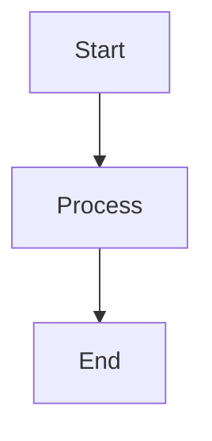

# waQup Documentation

A comprehensive documentation system for waQup with automatic HTML generation, Mermaid diagram support, and GitHub Pages hosting.

## 🌐 Viewing the Documentation

### Option 1: GitHub Pages (Recommended)
Once GitHub Pages is enabled, view the documentation at:
**https://innerflect-tech.github.io/waqup-documentation/**

### Option 2: View on GitHub
- Browse the markdown files directly in the `content/` folder
- View rendered HTML files in the `docs/` folder

### Option 3: Local Development
Clone the repository and run locally (see Setup below)

## 🚀 Setting Up GitHub Pages

1. Go to your repository: https://github.com/InnerFlect-Tech/waqup-documentation
2. Click **Settings** → **Pages**
3. Under **Source**, select:
   - **Branch**: `main`
   - **Folder**: `/docs`
4. Click **Save**
5. Wait a few minutes for GitHub to build your site
6. Your documentation will be available at: `https://innerflect-tech.github.io/waqup-documentation/`

## Features

- 📝 **Multiple Markdown Files**: Organize content across multiple documentation files
- 🎨 **Beautiful HTML Output**: Automatically styled HTML with modern design
- 📊 **Mermaid Diagrams**: Full support for Mermaid diagrams in your markdown
- 🔄 **Auto-Rebuild**: Automatically rebuilds HTML when markdown files change
- 📑 **Table of Contents**: Auto-generated navigation for all sections
- 🌐 **GitHub Pages Ready**: Pre-configured for easy hosting

## Setup

1. Install dependencies:
```bash
npm install
```

2. Build the HTML once:
```bash
npm run build
```

3. Watch for changes and auto-rebuild:
```bash
npm run watch
```

Or use the serve command (same as watch):
```bash
npm run serve
```

## Project Structure

```
waQup/
├── content/                    # Source markdown files
│   ├── 01-architecture-overview.md
│   ├── 02-features-workflows.md
│   ├── 03-data-flow.md
│   ├── 04-user-journey.md
│   ├── 05-api-flow.md
│   ├── 06-development-timeline.md
│   └── WAQUP_*.md             # Additional documentation files
├── docs/                       # Generated HTML files (for GitHub Pages)
│   ├── index.html             # Main documentation page
│   └── *.html                 # Individual documentation pages
├── content-consolidated/       # Consolidated documentation
├── template.html              # HTML template
├── build.js                   # Build script
├── watch.js                   # Watch script
└── package.json
```

## Usage

### Adding Content

1. Edit any markdown file in the `content/` directory
2. The HTML will automatically rebuild when you save
3. Open `index.html` in your browser to view the result

### Mermaid Diagrams

Add Mermaid diagrams using code blocks:

````markdown

````

Supported diagram types:
- Flowcharts
- Sequence diagrams
- Gantt charts
- Class diagrams
- State diagrams
- And more!

### File Naming

Files are processed in alphabetical order. Use numbered prefixes (like `01-`, `02-`) to control the order:
- `01-overview.md` - First section
- `02-features.md` - Second section
- etc.

## Customization

### Styling

Edit `template.html` to customize the appearance:
- Colors
- Fonts
- Layout
- Spacing

### Build Process

Modify `build.js` to:
- Change how files are processed
- Add custom markdown plugins
- Modify the HTML structure

## Development

The system uses:
- **markdown-it**: Markdown parser
- **chokidar**: File watcher
- **Mermaid.js**: Diagram rendering (via CDN)

## Notes

- The HTML files in `docs/` are automatically generated - don't edit them manually
- All markdown files in the `content/` directory will be included
- Mermaid diagrams are rendered client-side using the Mermaid.js library

## 📚 Documentation Files

The repository contains comprehensive documentation covering:

- **Architecture Overview**: System design and components
- **Features & Workflows**: Core functionality and user workflows
- **Data Flow**: How data moves through the system
- **User Journey**: End-to-end user experience
- **API Flow**: API endpoints and interactions
- **Development Timeline**: Project milestones and roadmap
- **System Architecture**: Detailed technical architecture
- **AI Voice & Ethics**: Voice AI implementation and ethical considerations
- **Content Types & Taxonomy**: Content organization system
- **Conversational & Ritual System**: Core platform features
- **Credits System**: Economic model and credits
- **Product Constitution**: Product principles and guidelines
- **Roadmap & Releases**: Version planning and releases
- **Scientific Foundations**: Research and methodology
- **Value & Growth Economy**: Economic model and growth strategy

## 🔄 Updating Documentation

1. Edit markdown files in the `content/` folder
2. Run `npm run build` to regenerate HTML files
3. Commit and push changes:
   ```bash
   git add .
   git commit -m "Update documentation"
   git push origin main
   ```
4. GitHub Pages will automatically update (may take a few minutes)

## 🤝 Contributing

1. Fork the repository
2. Make your changes to markdown files in `content/`
3. Run `npm run build` to update HTML files
4. Commit your changes
5. Push to your fork and create a Pull Request

