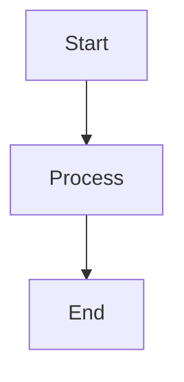

# waQup Content Management System

A system for managing and viewing content from multiple Markdown files with automatic HTML generation and Mermaid diagram support.

## Features

- 📝 **6 Markdown Files**: Organize your content across multiple files
- 🎨 **Beautiful HTML Output**: Automatically styled HTML with modern design
- 📊 **Mermaid Diagrams**: Full support for Mermaid diagrams in your markdown
- 🔄 **Auto-Rebuild**: Automatically rebuilds HTML when markdown files change
- 📑 **Table of Contents**: Auto-generated navigation for all sections

## Setup

1. Install dependencies:
```bash
npm install
```

2. Build the HTML once:
```bash
npm run build
```

3. Watch for changes and auto-rebuild:
```bash
npm run watch
```

Or use the serve command (same as watch):
```bash
npm run serve
```

## Project Structure

```
waQup/
├── content/              # Your markdown files go here
│   ├── 01-overview.md
│   ├── 02-features.md
│   ├── 03-architecture.md
│   ├── 04-user-guide.md
│   ├── 05-api-reference.md
│   └── 06-roadmap.md
├── template.html         # HTML template
├── index.html           # Generated HTML (auto-created)
├── build.js             # Build script
├── watch.js             # Watch script
└── package.json
```

## Usage

### Adding Content

1. Edit any markdown file in the `content/` directory
2. The HTML will automatically rebuild when you save
3. Open `index.html` in your browser to view the result

### Mermaid Diagrams

Add Mermaid diagrams using code blocks:

````markdown

````

Supported diagram types:
- Flowcharts
- Sequence diagrams
- Gantt charts
- Class diagrams
- State diagrams
- And more!

### File Naming

Files are processed in alphabetical order. Use numbered prefixes (like `01-`, `02-`) to control the order:
- `01-overview.md` - First section
- `02-features.md` - Second section
- etc.

## Customization

### Styling

Edit `template.html` to customize the appearance:
- Colors
- Fonts
- Layout
- Spacing

### Build Process

Modify `build.js` to:
- Change how files are processed
- Add custom markdown plugins
- Modify the HTML structure

## Development

The system uses:
- **markdown-it**: Markdown parser
- **chokidar**: File watcher
- **Mermaid.js**: Diagram rendering (via CDN)

## Notes

- The HTML file (`index.html`) is automatically generated - don't edit it manually
- All markdown files in the `content/` directory will be included
- Mermaid diagrams are rendered client-side using the Mermaid.js library

