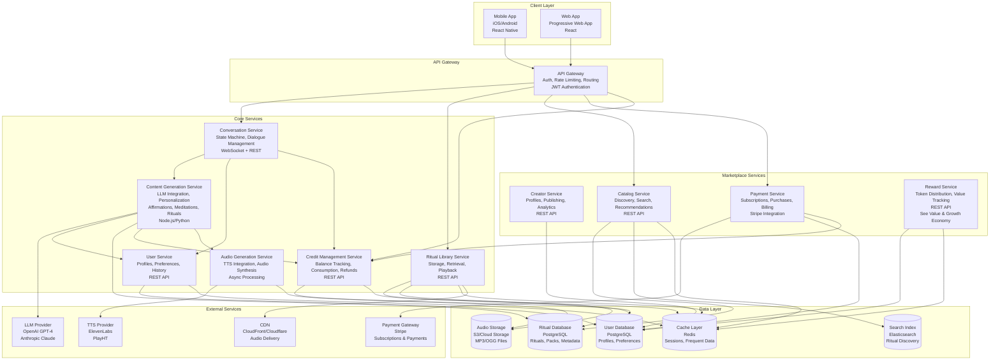

# Architecture Overview

> **⚠️ Archived Reference Document**  
> This document is kept for historical reference. The complete, up-to-date content has been merged into the **[System Architecture](./waqup_system_architecture.html)** document.

**Domain**: HOW waQup is built (full stack, APIs, infrastructure, deployment)

**Merged Into**: [System Architecture](./waqup_system_architecture.html#architecture-overview)

---
- Content Types & Taxonomy: Three content types (affirmations, meditations, rituals) and their generation requirements
- Product Constitution: WHAT waQup is (identity, invariants, boundaries)
- Value & Growth Economy: HOW value, rewards, tokens, and growth circulate
- Credits System: HOW credits manage AI resource consumption
- Conversational & Ritual System: HOW humans interact with waQup (state machines, content creation lifecycle)
- Data Flow: Detailed data movement patterns (complementary to this document)

## System Architecture

waQup is built as a cloud-native, microservices-oriented platform optimized for voice-first interactions, real-time conversation, and audio generation/streaming. The system prioritizes low-latency voice interactions, reliable audio delivery, and scalable ritual generation.

## High-Level Architecture Diagram

## Technology Stack

### Backend
- **Runtime**: Node.js (TypeScript) or Python (FastAPI)
- **API Framework**: Express.js / FastAPI
- **API Protocol**: REST + WebSocket (for real-time conversation)
- **Database**: PostgreSQL (primary data store)
- **Cache**: Redis (session state, frequently accessed data)
- **Search**: Elasticsearch (ritual discovery, full-text search)
- **Message Queue**: RabbitMQ / AWS SQS (async job processing)
- **Object Storage**: AWS S3 / Google Cloud Storage (audio files)

### Frontend
- **Mobile**: React Native (iOS/Android)
- **Web**: React (Progressive Web App)
- **State Management**: Zustand / Redux Toolkit
- **Audio Playback**: Web Audio API / React Native Audio
- **Real-time**: WebSocket client

### Infrastructure
- **Hosting**: AWS / Google Cloud Platform
- **Containerization**: Docker
- **Orchestration**: Kubernetes / ECS
- **CI/CD**: GitHub Actions / GitLab CI
- **Monitoring**: Datadog / New Relic / Prometheus + Grafana
- **Logging**: ELK Stack / CloudWatch
- **CDN**: CloudFront / Cloudflare (audio delivery)

## Core Services Architecture

### Conversation Service
Manages the state machine for ritual creation and return loops. Handles dialogue flow, context management, and user intent extraction.

**Key Responsibilities**:
- Maintain conversation state per user session
- Route user inputs to appropriate handlers
- Extract intent and context from natural language
- Coordinate with Ritual Generation Service
- Manage ephemeral vs. persistent conversation data

### Content Generation Service
Generates personalized content (affirmations, guided meditations, rituals) using LLM based on user conversation and context.

**Key Responsibilities**:
- Validate credit availability before generation (via Credit Management Service)
- Adapt generation logic based on content type (affirmation, meditation, ritual)
- Call LLM with user intent, conversation history, and content type
- Apply type-specific structure (affirmations: statements, meditations: state induction, rituals: identity encoding)
- Apply personalization rules based on user profile and history
- Structure content according to waQup format (type-specific)
- Trigger audio generation after text generation
- Consume credit on successful completion (cost varies by type)
- Store generated content in database (with content_type)
- Request credit refund on generation failure

### Audio Generation Service
Converts ritual text to audio using TTS, applies voice characteristics, and stores audio files.

**Key Responsibilities**:
- Call TTS API with ritual text and voice selection
- Apply voice characteristics (pace, tone, pauses)
- Store generated audio in object storage
- Generate audio metadata (duration, format, quality)
- Handle audio format conversion and optimization

### Ritual Library Service
Manages user's saved rituals, playback, and ritual history.

**Key Responsibilities**:
- Store and retrieve user's ritual library
- Track playback history and practice frequency
- Provide audio streaming URLs
- Handle ritual sharing and export
- Manage ritual organization (tags, folders)
- Free unlimited replay (no credit consumption)

### Credit Management Service
Manages user credit balances, consumption, and refunds.

**Key Responsibilities**:
- Track credit balance per user
- Validate credit availability before consumption
- Process credit consumption on successful ritual creation
- Handle credit refunds on system errors
- Record credit transaction history
- Integrate with Payment Service for credit purchases
- Provide credit balance API endpoints

## Data Architecture

### Primary Databases

**PostgreSQL**:
- User profiles and preferences
- Ritual metadata and text
- Ritual packs and creator data
- Practice history
- Conversation history
- Payment and subscription data
- Credit balances and transactions
- Reward transactions

**Redis**:
- Session state (conversation state machine)
- User profiles cache
- Ritual metadata cache
- Search results cache
- Audio URLs cache

**Elasticsearch**:
- Ritual pack search index
- Full-text search capabilities
- Discovery and recommendation data

**S3/Cloud Storage**:
- Generated audio files (MP3/OGG)
- Organized by user_id/ritual_id
- Served via CDN for fast delivery

## Security Architecture

- **Authentication**: JWT tokens, refresh token rotation
- **Authorization**: Role-based access control (user, creator, admin)
- **Data Encryption**: TLS in transit, encryption at rest for sensitive data
- **API Security**: Rate limiting, input validation, SQL injection prevention
- **Audio Security**: Pre-signed URLs with expiration, access control
- **Payment Security**: PCI compliance via Stripe, no card data storage
- **Privacy**: Data minimization, user consent for tracking, GDPR compliance

**Note**: For detailed data flow security patterns, see Data Flow document. For ethical privacy principles, see AI Voice & Ethics document.

## Scalability Strategy

### Initial Scale (Year 1)
- **Users**: 10,000 active users
- **Rituals**: 100,000 generated rituals
- **Daily Practices**: 5,000 practice sessions
- **Audio Storage**: 1 TB
- **API Requests**: 100,000 requests/day

### Growth Scale (Year 2-3)
- **Users**: 100,000 active users
- **Rituals**: 1,000,000 generated rituals
- **Daily Practices**: 50,000 practice sessions
- **Audio Storage**: 10 TB
- **API Requests**: 1,000,000 requests/day

### Scaling Approach
- **Horizontal Scaling**: Stateless services scale horizontally
- **Database Scaling**: Read replicas for read-heavy workloads, connection pooling
- **Caching**: Aggressive caching to reduce database load
- **CDN**: All audio delivery via CDN
- **Async Processing**: Audio generation and LLM calls via message queue
- **Cost Optimization**: Reserved instances, spot instances for batch jobs

## Deployment Architecture

- **Environments**: Development, Staging, Production
- **Containerization**: Docker containers for all services
- **Orchestration**: Kubernetes for production, Docker Compose for local dev
- **CI/CD**: Automated testing, building, and deployment
- **Blue-Green Deployment**: Zero-downtime deployments
- **Database Migrations**: Versioned migrations, rollback capability
- **Feature Flags**: Gradual feature rollouts, A/B testing support

## Observability

### Logging
- **Structured Logging**: JSON format with correlation IDs
- **Log Levels**: ERROR, WARN, INFO, DEBUG
- **Sensitive Data**: Never log passwords, tokens, or payment data
- **Log Aggregation**: Centralized logging via ELK Stack or CloudWatch

### Monitoring
- **Metrics**: Request latency, error rates, audio generation time, LLM call latency
- **Alerts**: Error rate spikes, latency degradation, service downtime
- **Dashboards**: Service health, user activity, marketplace metrics

### Tracing
- **Distributed Tracing**: Request tracing across services (Jaeger/Zipkin)
- **Correlation IDs**: Track requests through entire system

