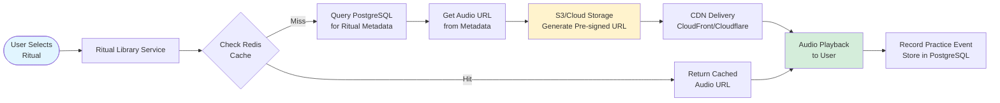
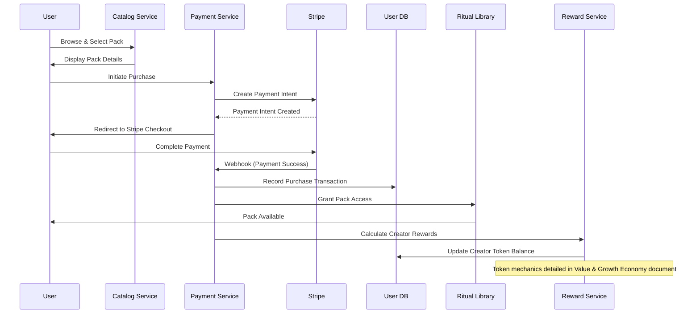

# Data Flow

> **⚠️ Archived Reference Document**  
> This document is kept for historical reference. The complete, up-to-date content has been merged into the **[System Architecture](./waqup_system_architecture.html#data-flow)** document.

**Domain**: HOW data moves through waQup's system (data flows, storage patterns, privacy)

---

**Related SSOT Documents**:
- Content Types & Taxonomy: Content type definitions and database schema
- Architecture Overview: System architecture and infrastructure (complementary)
- AI Voice & Ethics: Ethical data handling principles

## Overview

waQup's data flow architecture ensures efficient, secure, and scalable handling of user data, ritual generation, audio processing, and marketplace transactions. Data flows through multiple layers: client, API gateway, services, data stores, and external integrations.

## Ritual Creation Data Flow


## Audio Playback Data Flow



## Marketplace Purchase Data Flow



## Data Storage Architecture

### Persistent Storage (PostgreSQL)

**Users Table**:
```
- id (UUID, primary key)
- email (string, unique)
- created_at (timestamp)
- preferences (JSONB: voice, pace, tone preferences)
- practice_history_summary (JSONB: total practices, last practice)
- credit_balance (integer, default: 1 for free tier)
```

**Credit Transactions Table**:
```
- id (UUID, primary key)
- user_id (UUID, foreign key)
- transaction_type (enum: purchase, consumption, refund)
- amount (integer, credits)
- balance_after (integer)
- content_item_id (UUID, nullable, foreign key) -- replaces ritual_id
- content_type (enum: affirmation, guided_meditation, ritual, nullable)
- created_at (timestamp)
- metadata (JSONB: purchase_pack_id, refund_reason, etc.)
```

**Content Items Table** (replaces Rituals Table):
```
- id (UUID, primary key)
- user_id (UUID, foreign key)
- content_type (enum: affirmation, guided_meditation, ritual) NOT NULL
- title (string)
- content_text (text)
- voice_id (UUID, foreign key)
- audio_url (string, S3 URL)
- audio_duration (integer, seconds)
- depth (string: shallow, medium, deep) -- system-assigned
- tags (TEXT[] array)
- structure (JSONB: type-specific structure)
- context (JSONB: creation context, personalization)
- created_at (timestamp)
- last_played_at (timestamp)
- play_count (integer, for reference only)
- metadata (JSONB: additional metadata)
```

**Note**: See Content Types & Taxonomy document for detailed schema and type definitions.

**Ritual Packs Table**:
```
- id (UUID, primary key)
- creator_id (UUID, foreign key)
- title (string)
- description (text)
- price_type (enum: free, one_time, subscription)
- price_amount (decimal)
- subscription_interval (enum: monthly, annual)
- published_at (timestamp)
- status (enum: draft, published, archived)
```

**Conversations Table**:
```
- id (UUID, primary key)
- user_id (UUID, foreign key)
- session_id (string)
- messages (JSONB: array of messages)
- state (JSONB: state machine state)
- created_at (timestamp)
- completed_at (timestamp)
- resulting_ritual_id (UUID, nullable)
```

**Practice Events Table**:
```
- id (UUID, primary key)
- user_id (UUID, foreign key)
- ritual_id (UUID, foreign key)
- started_at (timestamp)
- completed_at (timestamp, nullable)
- duration (integer, seconds)
- metadata (JSONB: context, device)
```

### Ephemeral Storage (Redis)

**Session State**:
```
Key: session:{session_id}
Value: {
  state: "IntentDiscovery" | "ContextGathering" | ...
  context: { intent, time, location, ... }
  user_id: UUID
}
TTL: 1 hour
```

**User Profile Cache**:
```
Key: user:{user_id}:profile
Value: { preferences, voice_selection, ... }
TTL: 15 minutes
```

**Ritual Metadata Cache**:
```
Key: ritual:{ritual_id}:metadata
Value: { title, duration, audio_url, ... }
TTL: 1 hour
```

**Search Results Cache**:
```
Key: search:{query_hash}
Value: [pack_ids, ...]
TTL: 5 minutes
```

### Object Storage (S3/Cloud Storage)

**Audio Files**:
```
Path: audio/{user_id}/{ritual_id}/{version}.mp3
Format: MP3 or OGG
Retention: Permanent (until user deletion)
CDN: CloudFront/Cloudflare for delivery
```

## Data Flow Patterns

### Write Pattern (Ritual Creation)

1. **Ephemeral Data** (Redis):
   - Conversation state stored in Redis during creation
   - Fast access for state machine transitions
   - TTL: 1 hour (session timeout)

2. **Persistent Data** (PostgreSQL):
   - Ritual metadata written after generation
   - Conversation history persisted for personalization
   - Practice events recorded after completion

3. **Object Storage** (S3):
   - Audio files stored asynchronously
   - Pre-signed URLs generated for secure access
   - CDN distribution for fast delivery

### Read Pattern (Ritual Playback)

1. **Cache First** (Redis):
   - Check cache for ritual metadata
   - Check cache for audio URLs
   - Cache hit: Return immediately

2. **Database Fallback** (PostgreSQL):
   - Cache miss: Query database
   - Retrieve ritual metadata
   - Generate pre-signed S3 URL

3. **CDN Delivery** (CloudFront/Cloudflare):
   - Audio served via CDN
   - Low latency, global distribution
   - Reduced origin server load

### Search Pattern (Marketplace Discovery)

1. **Cache Check** (Redis):
   - Check cached search results
   - Return if cache hit (< 5 minutes)

2. **Search Index** (Elasticsearch):
   - Query Elasticsearch for pack matches
   - Full-text search, filtering, sorting
   - Return pack IDs

3. **Database Lookup** (PostgreSQL):
   - Fetch full pack metadata
   - Include creator information
   - Return complete results

## Data Privacy & Security

### Data Minimization
- Collect only necessary data
- No biometric data without consent
- No location data without consent
- No social connections (not a social platform)

### Data Encryption
- TLS in transit (all API calls)
- Encryption at rest (sensitive data)
- Pre-signed URLs for audio (time-limited access)
- JWT tokens for authentication

### Data Access Control
- User data isolated by user_id
- Creator data isolated by creator_id
- Role-based access control (RBAC)
- Audit logging for sensitive operations

### Data Export & Deletion
- Users can export all data (JSON format)
- Users can delete account and all data
- Audio files deleted from S3
- Database records soft-deleted or purged
- GDPR compliance

**Note**: For comprehensive security architecture details, see Architecture Overview document. For ethical data handling principles, see AI Voice & Ethics document.

## Data Flow Performance

### Optimization Strategies

1. **Caching**:
   - Aggressive caching of frequently accessed data
   - Redis for hot data (sessions, profiles, metadata)
   - CDN for static assets (audio files)

2. **Async Processing**:
   - Audio generation via message queue
   - LLM calls can be async for non-real-time flows
   - Background jobs for analytics and reporting

3. **Database Optimization**:
   - Indexed queries (user_id, ritual_id, creator_id)
   - Read replicas for read-heavy workloads
   - Connection pooling
   - Query optimization

4. **CDN Distribution**:
   - All audio delivery via CDN
   - Global edge locations
   - Reduced latency for users worldwide

## Data Flow Monitoring

### Key Metrics
- **Latency**: API response times, audio generation time
- **Throughput**: Requests per second, rituals generated per hour
- **Cache Hit Rate**: Redis cache effectiveness
- **Error Rate**: Failed requests, generation failures
- **Storage**: Database size, S3 storage usage

### Alerting
- High latency (> 1s for API calls)
- High error rate (> 1% failures)
- Cache hit rate drop (< 80%)
- Storage capacity warnings (> 80% full)
- Service downtime

