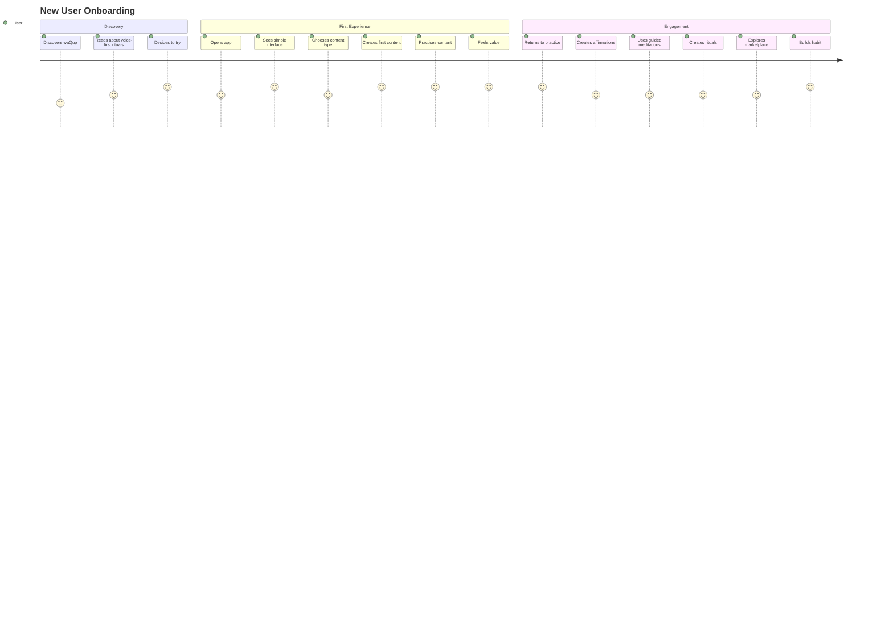
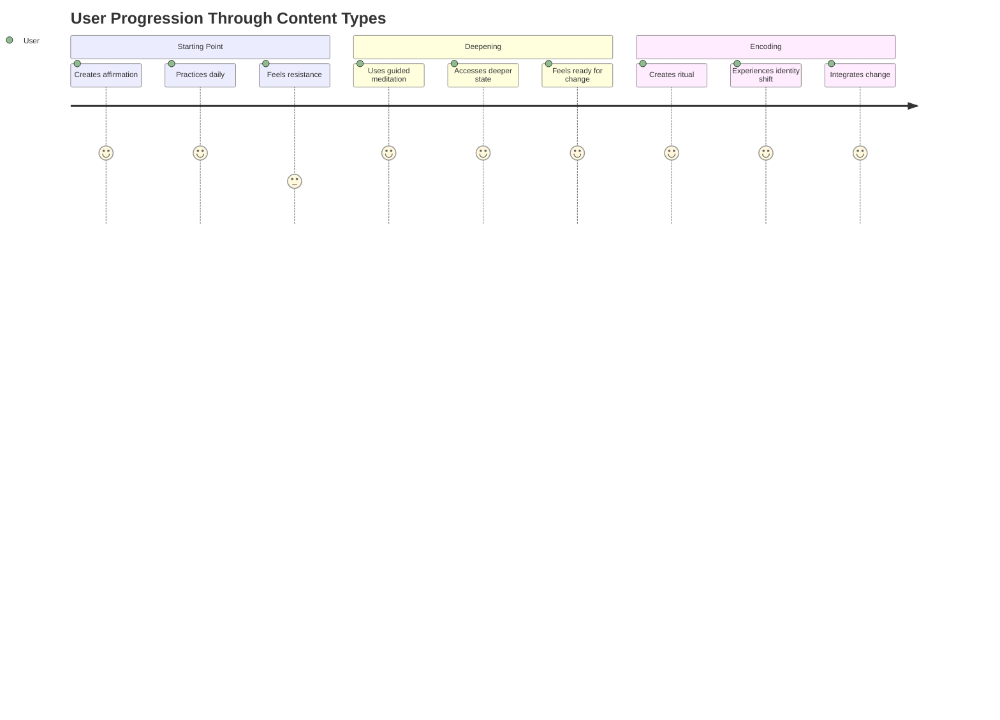
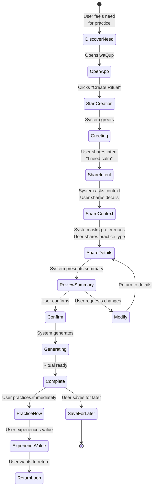
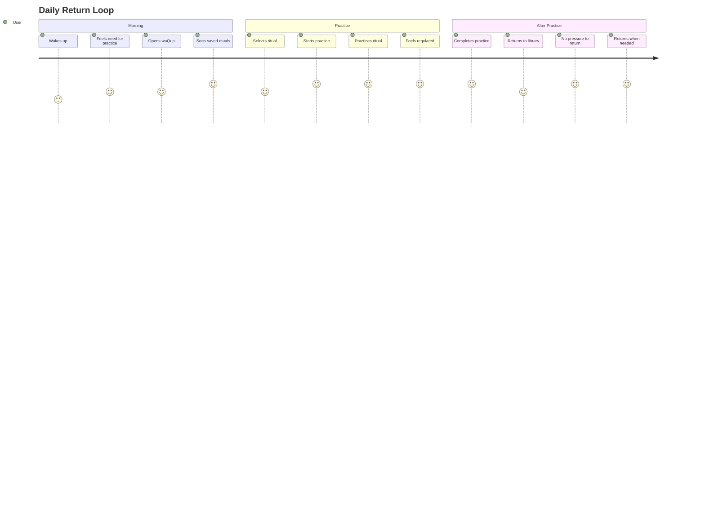
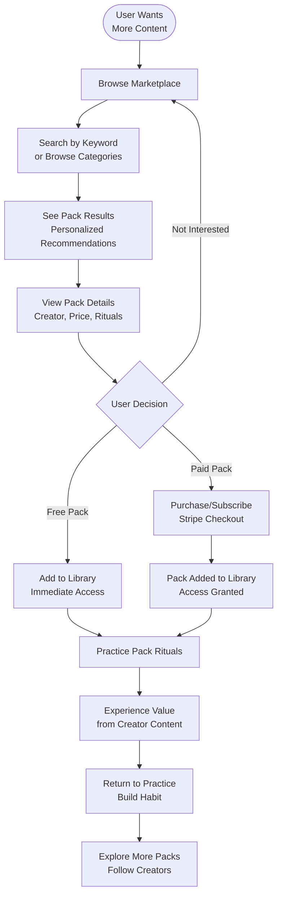
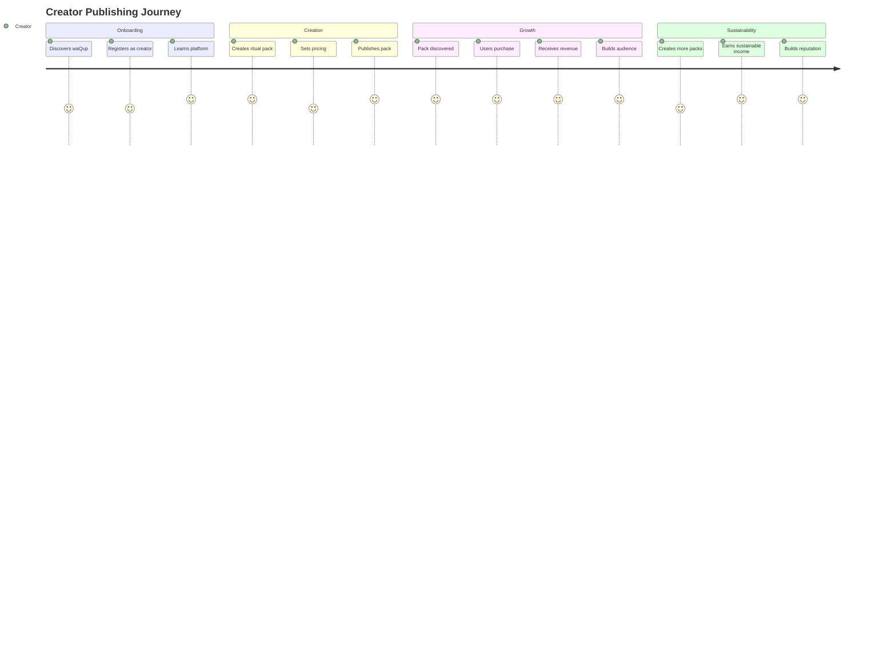

# User Journey

> **⚠️ Archived Reference Document**  
> This document is kept for historical reference. The complete, up-to-date content has been merged into the **[Conversational & Ritual System](./waqup_conversational_and_ritual_system.html#user-journey)** document.

**Domain**: HOW humans experience waQup (journey maps, touchpoints, principles)

---

**Related SSOT Documents**:
- Content Types & Taxonomy: Three content types and user progression through them
- Features & Workflows: Core features and workflow details
- Conversational & Ritual System: Detailed conversation flow implementation
- Value & Growth Economy: Economic value exchange in user journey
- AI Voice & Ethics: Ethical principles guiding user experience

## Overview

The waQup user journey is designed to be calm, trust-based, and regenerative. Users discover value through embodied practice, build habits through return loops, and engage with creators in a sustainable marketplace. No manipulation, no gamification, no dependency creation.

## New User Onboarding Journey

## Content Creation Journey (Three Types)

### Typical Progression Through Types

**Progression Logic**:
- **Affirmations repeat** (daily, lightweight)
- **Meditations open** (when resistance appears)
- **Rituals encode** (when something truly matters)

## Ritual Creation Journey (Deepest Type)

### Journey Stages

**1. Type Selection**
- User recognizes need for practice (stress, focus, sleep, etc.)
- Opens waQup app
- Sees three options: "Create Affirmation", "Create Guided Meditation", "Create Ritual"
- System explains depth difference (optional, first-time users)
- User chooses based on need and depth desired
- No pressure, no urgency

**2. Discovery & Intent**
- System greets warmly
- Asks open-ended question: "What kind of practice would support you right now?"
- User shares intent naturally
- System adapts questions based on content type selected
- No forms, no configuration screens

**3. Conversation Flow (Type-Specific)**
- **Affirmations**: Focus on statements, identity language, repetition
- **Guided Meditations**: Focus on state, imagery, breath, nervous system
- **Rituals**: Focus on context, meaning, identity shift, emotional anchoring
- System adapts questions based on responses and type
- No forms, no configuration screens

**4. Personalization**
- System gathers context (time, location, duration)
- System learns preferences (practice type, intensity, guidance style)
- System applies personalization (voice, pace, tone)
- User feels heard and understood

**5. Generation & Delivery**
- System generates personalized content (type-specific structure)
- System synthesizes audio with chosen voice
- Content appears in library (organized by type)
- User can practice immediately or save for later

**6. First Practice**
- User starts audio playback
- Voice guides through practice (type-appropriate)
- User experiences value (affirmation: cognitive shift, meditation: state access, ritual: identity encoding)
- Practice completes naturally
- No pressure, no gamification

## Return Loop Journey

### Return Loop Characteristics

**No Gamification**:
- No streaks displayed
- No badges or achievements
- No "X day streak" notifications
- No comparison with others

**Intrinsic Motivation**:
- Users return because practice serves them
- Value comes from embodied experience
- No external rewards or punishments
- Natural habit formation

**User Autonomy**:
- Users control when to practice
- No reminders or pressure
- No consequences for not practicing
- Easy to pause and resume

## Marketplace Discovery Journey

### Marketplace Journey Stages

**1. Discovery**
- User wants more variety or expertise
- Browses marketplace or searches
- Sees personalized recommendations
- No pressure, no FOMO

**2. Exploration**
- Views pack details (description, creator, rituals)
- Reads reviews and ratings
- Considers value proposition
- Makes informed decision

**3. Purchase/Subscription**
- Clear pricing (no hidden costs)
- Simple checkout process
- Transparent terms
- Immediate access after payment

**4. Practice & Value**
- Pack rituals available in library
- User practices and experiences value
- Returns to practice regularly
- Builds relationship with creator

**5. Engagement**
- User may follow creator
- User may explore more packs
- User may provide feedback
- Sustainable, trust-based relationship

## Creator Journey

### Creator Journey Stages

**1. Onboarding**
- Creator discovers waQup marketplace
- Registers as creator account
- Learns platform tools and guidelines
- Understands value proposition

**2. Pack Creation**
- Creator creates ritual pack
- Adds rituals with expertise
- Sets pricing (free, one-time, subscription)
- Publishes pack

**3. Discovery & Sales**
- Pack appears in marketplace
- Users discover through search/recommendations
- Users purchase or subscribe
- Creator receives revenue share (see Value & Growth Economy document for revenue distribution details)

**4. Growth & Sustainability**
- Creator builds audience
- Receives feedback and reviews
- Creates more packs
- Builds sustainable income stream

## User Journey Principles

### Trust-Based
- No manipulation or dark patterns
- Transparent pricing and terms
- Clear value proposition
- Honest communication

### Regenerative
- Value circulates to all participants (see Value & Growth Economy document)
- Creators earn sustainable income
- Users receive genuine value
- Platform grows organically

### User Autonomy
- Users control their practice
- No pressure or dependency
- Easy exit (export, delete)
- Respect for user agency

### Calm & Supportive
- No urgency or FOMO
- No comparison or competition
- Supportive, not pushy
- Respects user's pace

## Journey Metrics (Non-Gamified)

### Health Indicators
- **Return Rate**: Users who return to practice (intrinsic value)
- **Practice Frequency**: Natural practice patterns
- **Ritual Creation**: Users creating multiple rituals
- **Marketplace Engagement**: Users discovering and purchasing packs
- **Creator Revenue**: Sustainable income for creators

### What We Don't Track
- Streaks or consecutive days
- Comparison with other users
- Engagement scores or gamification metrics
- Manipulative conversion funnels
- Dependency indicators

## Journey Touchpoints

### Key Moments
1. **First Content Creation**: User experiences conversational creation (affirmation, meditation, or ritual)
2. **First Practice**: User experiences embodied value
3. **Type Progression**: User naturally progresses from affirmations → meditations → rituals
4. **First Return**: User naturally returns for practice
5. **First Pack Purchase**: User discovers creator value
6. **Habit Formation**: User builds sustainable practice across all types

### Support Points
- Clear onboarding (no overwhelming tutorials)
- Helpful conversation guidance
- Transparent marketplace information
- Easy ritual export and sharing
- Simple account management

## Journey Optimization

### Focus Areas
- **Conversation Quality**: Natural, adaptive dialogue
- **Ritual Personalization**: Accurate intent understanding
- **Audio Quality**: Natural, prosodically appropriate voices
- **Marketplace Discovery**: Effective search and recommendations
- **Creator Tools**: Easy publishing and analytics

### Anti-Patterns to Avoid
- Adding gamification to increase engagement
- Creating urgency or FOMO
- Manipulating user behavior
- Extracting value without providing value
- Creating dependency through withdrawal mechanics

