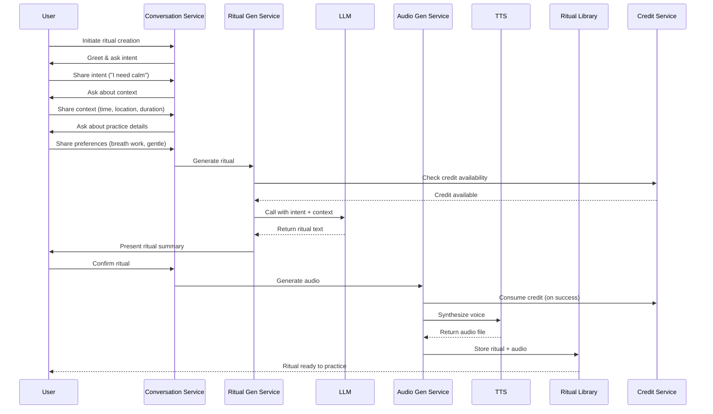
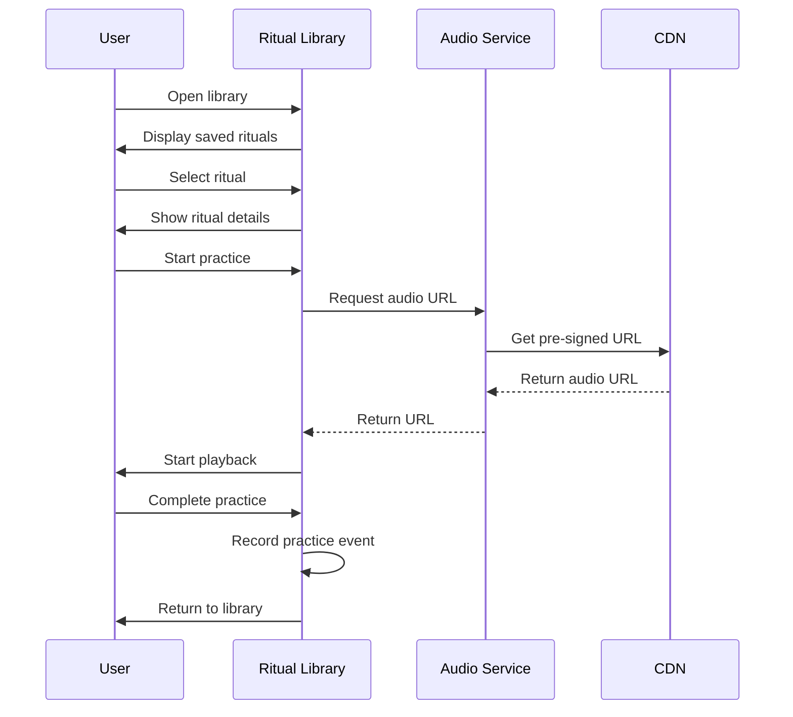
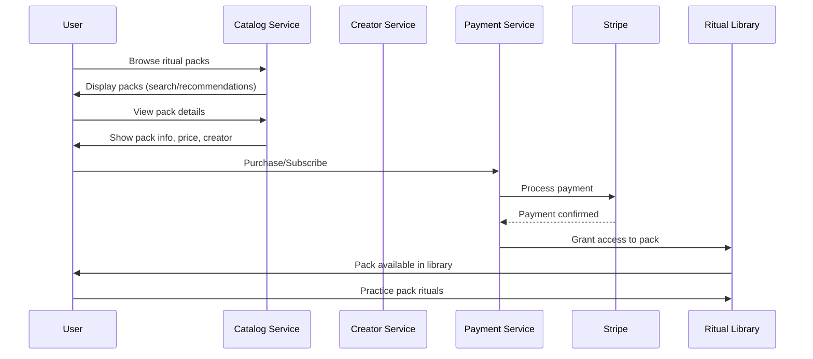
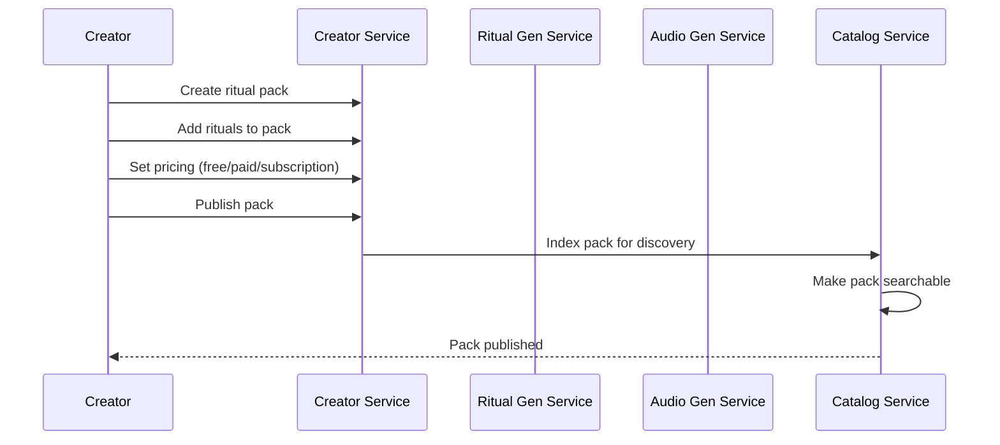
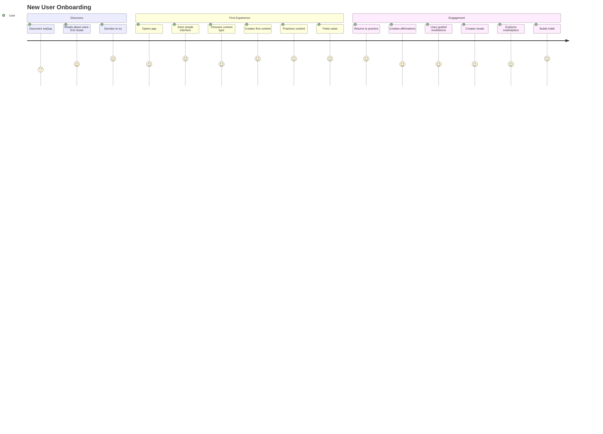
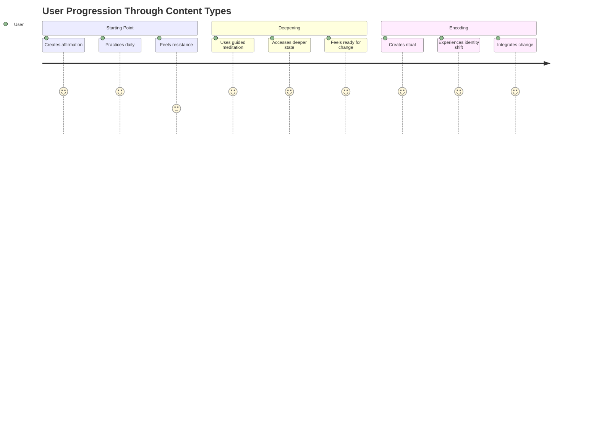
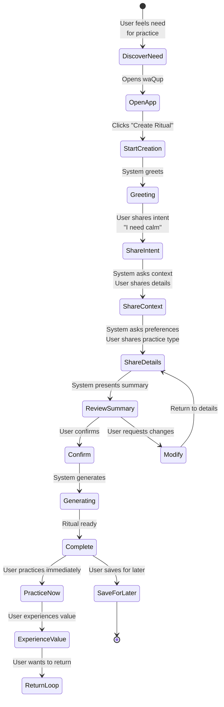
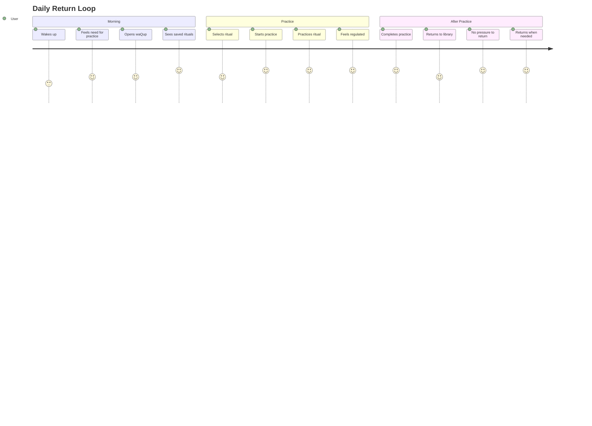
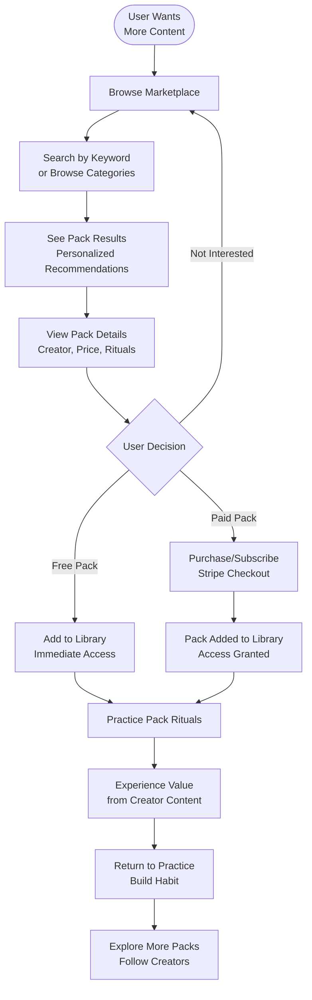
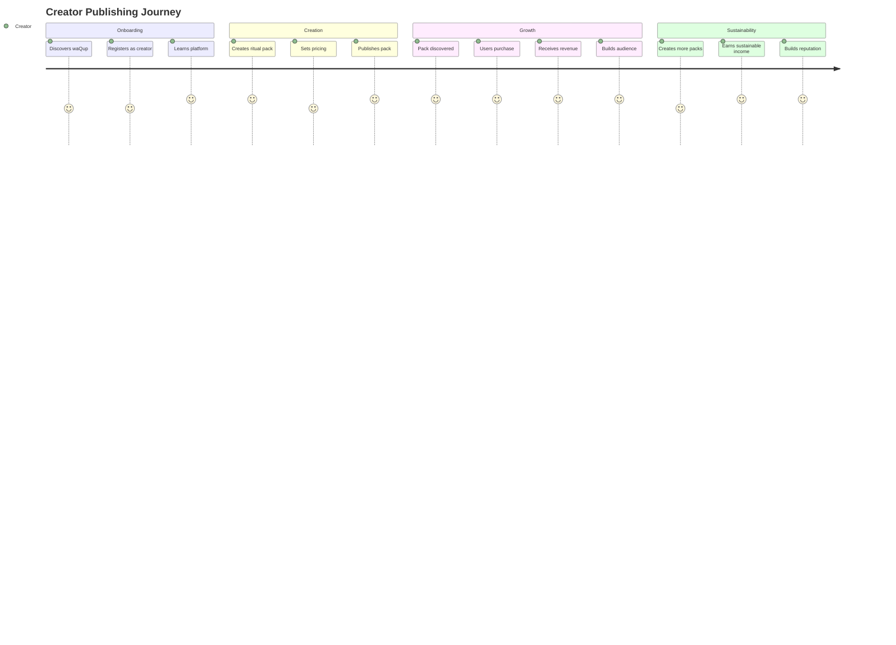

# Conversational & Ritual System

**Domain**: HOW humans interact with waQup (state machines, ritual lifecycle)

**Related SSOT Documents**:
- [Product Constitution](./waqup_product_constitution.html): WHAT waQup is
- [System Architecture](./waqup_system_architecture.html): HOW waQup is built
- [Scientific Foundations](./waqup_scientific_foundations.html): WHY waQup works

---

## Table of Contents

- [Content Types & Taxonomy](#content-types--taxonomy)
- [Features & Workflows](#features--workflows)
- [User Journey](#user-journey)
- [State Machine & Conversation Flow](#state-machine--conversation-flow)

---

## Content Types & Taxonomy

## Core Principle: Three Depths, Not Interchangeable

waQup is built on **three different depths of subconscious engagement**.

They are **not interchangeable**.

Think of them as **layers**:

1. **Affirmations** → cognitive re-patterning (shallow → medium)
2. **Guided Meditations** → state induction (medium)
3. **Rituals** → identity encoding (deepest)

Most apps confuse these. waQup separates them **on purpose**.

---

## 1. Affirmations (Micro-Reprogramming)

### What Affirmations Are in waQup

Affirmations are **precise linguistic encodings** designed to:
- Bypass resistance
- Avoid negation errors
- Align language with felt identity

They are **not**:
- Positive thinking
- Wishful statements
- Surface motivation

They are **syntax-correct instructions to the subconscious**.

### How They Work Psychologically

1. The brain responds to present-tense identity language
2. Repetition builds neural familiarity
3. Familiarity reduces threat
4. Reduced threat allows adoption

**Example**:
- ❌ "I am becoming calm"
- ✅ "I am calm and present in my body"

### In the App

**Characteristics**:
- Can exist alone (standalone affirmations)
- Can be listened to daily (lightweight, repeatable)
- Can be recorded in:
  - User's voice
  - Selected voice
- Fast generation (less AI processing)
- Shorter duration (1-5 minutes)

**Depth**: Shallow → Medium

**Use Cases**: Habits, mindset, focus, confidence, daily reinforcement

**Credit Cost**: 0.5 credits (lighter AI processing)

**Structure**:
- Core affirmation statements (3-7 statements)
- Present-tense identity language
- Repetition pattern
- Optional: brief grounding

---

## 2. Guided Meditations (State + Imagery)

### What Guided Meditations Are

Guided meditations are **state-induction journeys**.

They use:
- Breath
- Attention direction
- Imagery
- Pacing
- Silence

Their purpose is **not identity change, but state access**.

### How They Work Psychologically

1. Slow the nervous system
2. Shift brainwave dominance
3. Increase suggestibility
4. Open access to emotional material

They **prepare the terrain, but don't rewrite the map**.

### In the App

**Characteristics**:
- Can be generic (relaxation, grounding, presence)
- Can be semi-personalized
- Can be listened to without credits (once created)
- Can include affirmations inside them
- Medium duration (5-20 minutes)
- Moderate AI processing

**Depth**: Medium

**Use Cases**: Regulation, stress, clarity, emotional access, nervous system regulation

**Credit Cost**: 1 credit (standard AI processing)

**Structure**:
- Grounding / arrival
- Breath work
- Attention direction
- Imagery / visualization
- Optional: embedded affirmations
- Closure / return

---

## 3. Rituals (Identity Encoding — The Core)

### What Rituals Are (This is Key)

A waQup ritual is a **structured act of self-authorship**.

It combines:
- Reflection
- Intention
- Language
- Voice
- Repetition
- Emotional imprint

**Rituals are not content. They are events.**

### What Makes Rituals Different

Rituals:
- Are **created, not consumed**
- Include **context** (why this matters)
- Encode **identity-level language**
- Are tied to a **moment in life**

This is why they are **rare — and powerful**.

### Structure of a Ritual (Simplified)

A ritual typically includes:
1. **Grounding / arrival** (nervous system regulation)
2. **Context** (what is changing, why this matters)
3. **Core affirmations** (personalized, identity-level)
4. **Emotional anchoring** (felt sense integration)
5. **Closure / integration** (commitment to new identity)

This structure is what makes it **stick**.

### In the App

**Characteristics**:
- Ritual creation consumes credits (highest cost)
- Ritual playback is unlimited (free)
- Rituals can evolve over time
- Rituals become part of the user's inner archive
- Longer duration (10-30 minutes)
- Highest AI processing (full personalization)

**Depth**: Deep

**Use Cases**: Identity shifts, transitions, trauma-safe re-framing, life thresholds, major changes

**Credit Cost**: 1 credit (full AI processing, highest value)

**Structure**:
- Grounding / arrival
- Context (personalized, why this matters)
- Core affirmations (identity-level, personalized)
- Emotional anchoring (felt sense)
- Closure / integration (commitment)

---

## 4. How the Three Work Together (System Logic)

### Typical User Journey

1. **User starts with affirmations** (lightweight, daily)
2. **When resistance appears** → uses guided meditation (state access)
3. **When something truly matters** → creates a ritual (identity encoding)

**Affirmations repeat**  
**Meditations open**  
**Rituals encode**

### Internal Hierarchy

- **Affirmations** = statements (cognitive layer)
- **Guided meditations** = states (nervous system layer)
- **Rituals** = identity contracts (deepest layer)

waQup doesn't force one path — it offers **depth when needed**.

---

## 5. Taxonomy System

### Primary Classification: Content Type

**Required field**: `content_type` (enum)
- `affirmation`
- `guided_meditation`
- `ritual`

### Secondary Classification: Tags

**Tags** are flexible, user-defined, and system-suggested.

#### System Tags (Predefined)

**By Use Case**:
- `habits` (affirmations)
- `mindset` (affirmations)
- `focus` (affirmations)
- `confidence` (affirmations)
- `regulation` (meditations)
- `stress` (meditations)
- `clarity` (meditations)
- `emotional-access` (meditations)
- `identity-shift` (rituals)
- `transition` (rituals)
- `trauma-safe` (rituals)
- `life-threshold` (rituals)

**By Practice Type** (for rituals and meditations):
- `breath-work`
- `body-scanning`
- `movement`
- `sensory-awareness`
- `visualization`
- `combination`

**By Time/Context**:
- `morning`
- `evening`
- `before-sleep`
- `anxiety`
- `calming`
- `energizing`
- `grounding`

**By Depth** (system-assigned):
- `shallow` (affirmations)
- `medium` (meditations, some affirmations)
- `deep` (rituals)

#### User Tags (Custom)

Users can add custom tags:
- Personal context tags
- Life event tags
- Emotional state tags
- Any meaningful categorization

**Tag Rules**:
- Maximum 10 tags per content item
- Tags are lowercase, hyphenated
- System suggests tags based on content analysis
- Users can remove/add tags freely

### Tertiary Classification: Collections

**Collections** are user-organized groups:
- Folders (user-created)
- Packs (creator-published)
- Sequences (multiple items in order)

---

## 6. Database Schema

### Content Items Table

```sql
CREATE TABLE content_items (
    id UUID PRIMARY KEY,
    user_id UUID REFERENCES users(id),
    content_type ENUM('affirmation', 'guided_meditation', 'ritual') NOT NULL,
    
    -- Core fields
    title VARCHAR(255) NOT NULL,
    content_text TEXT NOT NULL,
    audio_url VARCHAR(500),
    audio_duration INTEGER, -- seconds
    
    -- Type-specific fields
    structure JSONB, -- type-specific structure
    context JSONB, -- creation context, personalization
    
    -- Metadata
    tags TEXT[], -- array of tag strings
    depth VARCHAR(20), -- shallow, medium, deep (system-assigned)
    
    -- Voice
    voice_id UUID REFERENCES voices(id),
    voice_type VARCHAR(50), -- 'user', 'standard', 'premium'
    
    -- Timestamps
    created_at TIMESTAMP NOT NULL,
    last_played_at TIMESTAMP,
    play_count INTEGER DEFAULT 0,
    
    -- Organization
    folder_id UUID REFERENCES folders(id),
    pack_id UUID REFERENCES ritual_packs(id), -- if part of pack
    
    -- Status
    status VARCHAR(20) DEFAULT 'active', -- active, archived, deleted
    
    -- Indexes
    INDEX idx_user_content_type (user_id, content_type),
    INDEX idx_tags (tags),
    INDEX idx_depth (depth)
);
```

### Tags Table (Normalized)

```sql
CREATE TABLE tags (
    id UUID PRIMARY KEY,
    name VARCHAR(100) UNIQUE NOT NULL,
    category VARCHAR(50), -- 'use-case', 'practice-type', 'time-context', 'custom'
    usage_count INTEGER DEFAULT 0,
    created_at TIMESTAMP DEFAULT NOW()
);

CREATE TABLE content_item_tags (
    content_item_id UUID REFERENCES content_items(id),
    tag_id UUID REFERENCES tags(id),
    PRIMARY KEY (content_item_id, tag_id)
);
```

---

## 7. API Design

### Filtering by Type

**GET /api/v1/content**
```json
Query Parameters:
- content_type: "affirmation" | "guided_meditation" | "ritual" | null (all)
- tags: string[] (filter by tags)
- depth: "shallow" | "medium" | "deep" | null (all)
- folder_id: uuid (optional)
- pack_id: uuid (optional)

Response:
{
  "content_items": [
    {
      "id": "uuid",
      "content_type": "ritual",
      "title": "Evening Calm",
      "depth": "deep",
      "tags": ["evening", "calming", "transition"],
      "duration": 600,
      "created_at": "2024-01-01T00:00:00Z"
    }
  ],
  "pagination": {...}
}
```

### Type-Specific Creation

**POST /api/v1/content/create**
```json
Request:
{
  "content_type": "affirmation" | "guided_meditation" | "ritual",
  "intent": "I need calm",
  "context": {...},
  "preferences": {...}
}

Response:
{
  "content_item_id": "uuid",
  "content_type": "ritual",
  "status": "generating",
  "estimated_time": 30
}
```

---

## 8. User Interface Organization

### Library View Options

1. **By Type** (default):
   - Affirmations tab
   - Guided Meditations tab
   - Rituals tab

2. **By Tags**:
   - Filter by tag
   - See all types with matching tag

3. **By Depth**:
   - Shallow (affirmations)
   - Medium (meditations)
   - Deep (rituals)

4. **By Collection**:
   - Folders
   - Packs
   - Sequences

### Creation Flow

**Step 1**: User selects content type
- "Create Affirmation" (lightweight)
- "Create Guided Meditation" (state access)
- "Create Ritual" (deep encoding)

**Step 2**: Conversation adapts to type
- Affirmations: Focus on statements, identity language
- Meditations: Focus on state, imagery, breath
- Rituals: Focus on context, meaning, identity shift

---

## 9. Credits Integration

### Credit Costs by Type

- **Affirmations**: 0.5 credits (lighter processing)
- **Guided Meditations**: 1 credit (standard processing)
- **Rituals**: 1 credit (full processing, highest value)

**Rationale**:
- Affirmations are shorter, simpler
- Meditations are standard length
- Rituals are full personalization (but same credit = intentional choice)

**Alternative**: All cost 1 credit (simplicity, intentionality)

---

## 10. Why This Design is Rare (and Strong)

### Most Apps:
- Mix everything (no distinction)
- Overload content (too many options)
- Remove authorship (pre-made content)

### waQup:
- Separates functions (clear hierarchy)
- Respects psychological layers (depth awareness)
- Gives ownership back to the user (self-authorship)

### This Creates:
- Higher trust (clear purpose)
- Deeper retention (meaningful progression)
- Emotional loyalty (identity-level connection)
- Ethical monetization (value-based pricing)

---

## 11. Open Questions

1. **Credit costs**: Should affirmations cost 0.5 credits or 1 credit?
2. **Tag limits**: Is 10 tags per item sufficient?
3. **Type transitions**: Can users convert affirmations → meditations → rituals?
4. **Pack types**: Can packs contain mixed types or single type only?
5. **Search**: Should search prioritize by type or relevance?

---

## Summary

The three content types form a **hierarchical system**:
- **Affirmations**: Cognitive re-patterning (shallow → medium)
- **Guided Meditations**: State induction (medium)
- **Rituals**: Identity encoding (deepest)

They are **not interchangeable** and serve different psychological purposes.

The taxonomy system supports:
- Type-based organization
- Flexible tagging
- User-defined collections
- Clear depth progression

This creates a **coherent, meaningful system** that respects psychological layers and user autonomy.


## Features & Workflows

## Core Features

### 1. Voice-First Content Creation
Users create personalized content (affirmations, guided meditations, or rituals) through guided conversation, not forms. The system uses natural language dialogue to understand intent, gather context, and generate customized practices.

**Three Content Types** (see Content Types & Taxonomy document):
- **Affirmations**: Cognitive re-patterning (0.5 credits)
- **Guided Meditations**: State induction (1 credit)
- **Rituals**: Identity encoding (1 credit)

**Key Characteristics**:
- Conversational interface (no forms or configuration screens)
- Natural language understanding
- Adaptive dialogue flow (adapts to content type)
- Real-time conversation via WebSocket
- Credit-based creation (cost varies by type, see Credits System document)
- Type selection before creation (user chooses depth)

### 2. Embodied Practice Content
All content types (affirmations, guided meditations, rituals) engage the body, though to different depths. Rituals and guided meditations emphasize embodied practice more than affirmations.

**Practice Types** (for meditations and rituals):
- Breath work (various techniques)
- Body scanning and awareness
- Gentle movement and stretching
- Sensory awareness practices
- Combination practices

**Note**: Affirmations focus on linguistic encoding; meditations and rituals include embodied practice.

### 3. Personalized Audio Generation
Rituals are generated as personalized audio files using LLM for text generation and TTS for voice synthesis.

**Personalization Elements**:
- Voice selection (user preference)
- Pace (slower for calming, moderate for energy)
- Tone (warm, supportive, matches intent)
- Ritual structure (adapted to duration and practice type)

### 4. Content Library & Return Loops
Users save content (affirmations, guided meditations, rituals) and return to practice them regularly. No gamification—users return for intrinsic value.

**Library Features**:
- Save unlimited personal content (all types)
- Organize by type (affirmations, meditations, rituals)
- Organize by tags (flexible tagging system)
- Organize in folders (user-created collections)
- Track practice history (for reference, not gamification)
- Export content (text and audio)
- Offline playback support
- **Unlimited replay** (practice is free, no credit consumption)

**Library Organization**:
- Filter by content type
- Filter by tags
- Filter by depth (shallow, medium, deep)
- Browse by collection (folders, packs, sequences)

### 5. Marketplace & Creator Ecosystem
Facilitators/creators publish ritual packs and custom voices. Users discover, purchase, and subscribe to creator content.

**Marketplace Features**:
- Browse and search ritual packs
- One-time purchases and subscriptions
- Creator profiles and follow functionality
- Personalized recommendations
- Reviews and ratings

### 6. Credits System
Resource management system for AI generation. Credits enable intentional creation while managing infrastructure costs.

**Key Principles**:
- Credits consumed only for creation/transformation (not practice)
- Credits never expire (no FOMO)
- Practice is free (unlimited replay)
- Transparent costs and balance

**Note**: For detailed credits mechanics, consumption rules, and pricing, see Credits System document.

### 7. Token/Reward System
Non-speculative recognition system for user and creator contributions. Tokens represent value exchange, not investment.

**Reward Types**:
- Practice tokens (for regular engagement)
- Creator tokens (for quality packs)
- Referral tokens (for word-of-mouth)
- Feedback tokens (for constructive feedback)

**Note**: For detailed token mechanics, distribution rules, and economic model, see Value & Growth Economy document.

## Ritual Creation Workflow



### Workflow States

1. **Greeting**: System welcomes user and explains the process
2. **Intent Discovery**: System asks what kind of practice would support the user
3. **Context Gathering**: System asks about time, location, duration, current state
4. **Practice Details**: System asks about practice type, body engagement, intensity, guidance style
5. **Personalization**: System applies voice, pace, tone, and structure preferences
6. **Confirmation**: System presents ritual summary for user approval
7. **Generation**: System generates ritual text (LLM) and audio (TTS)
8. **Complete**: Ritual is saved and ready to practice

**Note**: For detailed state machine implementation and conversational system architecture, see Conversational & Ritual System document.

## Return Loop Workflow



### Return Loop States

1. **Library**: User views saved rituals
2. **Ritual Selection**: User selects a ritual to practice
3. **Preview**: User reviews ritual details
4. **Personalization Check**: System checks if update needed (optional)
5. **Playing**: Audio playback begins
6. **Paused**: User can pause and resume
7. **Complete**: Practice finished, return to library

## Marketplace Workflow



### Creator Publishing Workflow




## User Journey

## Overview

The waQup user journey is designed to be calm, trust-based, and regenerative. Users discover value through embodied practice, build habits through return loops, and engage with creators in a sustainable marketplace. No manipulation, no gamification, no dependency creation.

## New User Onboarding Journey



## Content Creation Journey (Three Types)

### Typical Progression Through Types



**Progression Logic**:
- **Affirmations repeat** (daily, lightweight)
- **Meditations open** (when resistance appears)
- **Rituals encode** (when something truly matters)

## Ritual Creation Journey (Deepest Type)



### Journey Stages

**1. Type Selection**
- User recognizes need for practice (stress, focus, sleep, etc.)
- Opens waQup app
- Sees three options: "Create Affirmation", "Create Guided Meditation", "Create Ritual"
- System explains depth difference (optional, first-time users)
- User chooses based on need and depth desired
- No pressure, no urgency

**2. Discovery & Intent**
- System greets warmly
- Asks open-ended question: "What kind of practice would support you right now?"
- User shares intent naturally
- System adapts questions based on content type selected
- No forms, no configuration screens

**3. Conversation Flow (Type-Specific)**
- **Affirmations**: Focus on statements, identity language, repetition
- **Guided Meditations**: Focus on state, imagery, breath, nervous system
- **Rituals**: Focus on context, meaning, identity shift, emotional anchoring
- System adapts questions based on responses and type
- No forms, no configuration screens

**4. Personalization**
- System gathers context (time, location, duration)
- System learns preferences (practice type, intensity, guidance style)
- System applies personalization (voice, pace, tone)
- User feels heard and understood

**5. Generation & Delivery**
- System generates personalized content (type-specific structure)
- System synthesizes audio with chosen voice
- Content appears in library (organized by type)
- User can practice immediately or save for later

**6. First Practice**
- User starts audio playback
- Voice guides through practice (type-appropriate)
- User experiences value (affirmation: cognitive shift, meditation: state access, ritual: identity encoding)
- Practice completes naturally
- No pressure, no gamification

## Return Loop Journey



### Return Loop Characteristics

**No Gamification**:
- No streaks displayed
- No badges or achievements
- No "X day streak" notifications
- No comparison with others

**Intrinsic Motivation**:
- Users return because practice serves them
- Value comes from embodied experience
- No external rewards or punishments
- Natural habit formation

**User Autonomy**:
- Users control when to practice
- No reminders or pressure
- No consequences for not practicing
- Easy to pause and resume

## Marketplace Discovery Journey



### Marketplace Journey Stages

**1. Discovery**
- User wants more variety or expertise
- Browses marketplace or searches
- Sees personalized recommendations
- No pressure, no FOMO

**2. Exploration**
- Views pack details (description, creator, rituals)
- Reads reviews and ratings
- Considers value proposition
- Makes informed decision

**3. Purchase/Subscription**
- Clear pricing (no hidden costs)
- Simple checkout process
- Transparent terms
- Immediate access after payment

**4. Practice & Value**
- Pack rituals available in library
- User practices and experiences value
- Returns to practice regularly
- Builds relationship with creator

**5. Engagement**
- User may follow creator
- User may explore more packs
- User may provide feedback
- Sustainable, trust-based relationship

## Creator Journey



### Creator Journey Stages

**1. Onboarding**
- Creator discovers waQup marketplace
- Registers as creator account
- Learns platform tools and guidelines
- Understands value proposition

**2. Pack Creation**
- Creator creates ritual pack
- Adds rituals with expertise
- Sets pricing (free, one-time, subscription)
- Publishes pack

**3. Discovery & Sales**
- Pack appears in marketplace
- Users discover through search/recommendations
- Users purchase or subscribe
- Creator receives revenue share (see Value & Growth Economy document for revenue distribution details)

**4. Growth & Sustainability**
- Creator builds audience
- Receives feedback and reviews
- Creates more packs
- Builds sustainable income stream

## User Journey Principles

### Trust-Based
- No manipulation or dark patterns
- Transparent pricing and terms
- Clear value proposition
- Honest communication

### Regenerative
- Value circulates to all participants (see Value & Growth Economy document)
- Creators earn sustainable income
- Users receive genuine value
- Platform grows organically

### User Autonomy
- Users control their practice
- No pressure or dependency
- Easy exit (export, delete)
- Respect for user agency

### Calm & Supportive
- No urgency or FOMO
- No comparison or competition
- Supportive, not pushy
- Respects user's pace

## Journey Metrics (Non-Gamified)

### Health Indicators
- **Return Rate**: Users who return to practice (intrinsic value)
- **Practice Frequency**: Natural practice patterns
- **Ritual Creation**: Users creating multiple rituals
- **Marketplace Engagement**: Users discovering and purchasing packs
- **Creator Revenue**: Sustainable income for creators

### What We Don't Track
- Streaks or consecutive days
- Comparison with other users
- Engagement scores or gamification metrics
- Manipulative conversion funnels
- Dependency indicators

## Journey Touchpoints

### Key Moments
1. **First Content Creation**: User experiences conversational creation (affirmation, meditation, or ritual)
2. **First Practice**: User experiences embodied value
3. **Type Progression**: User naturally progresses from affirmations → meditations → rituals
4. **First Return**: User naturally returns for practice
5. **First Pack Purchase**: User discovers creator value
6. **Habit Formation**: User builds sustainable practice across all types

### Support Points
- Clear onboarding (no overwhelming tutorials)
- Helpful conversation guidance
- Transparent marketplace information
- Easy ritual export and sharing
- Simple account management

## Journey Optimization

### Focus Areas
- **Conversation Quality**: Natural, adaptive dialogue
- **Ritual Personalization**: Accurate intent understanding
- **Audio Quality**: Natural, prosodically appropriate voices
- **Marketplace Discovery**: Effective search and recommendations
- **Creator Tools**: Easy publishing and analytics

### Anti-Patterns to Avoid
- Adding gamification to increase engagement
- Creating urgency or FOMO
- Manipulating user behavior
- Extracting value without providing value
- Creating dependency through withdrawal mechanics


## State Machine & Conversation Flow

*State machine details to be added.*

