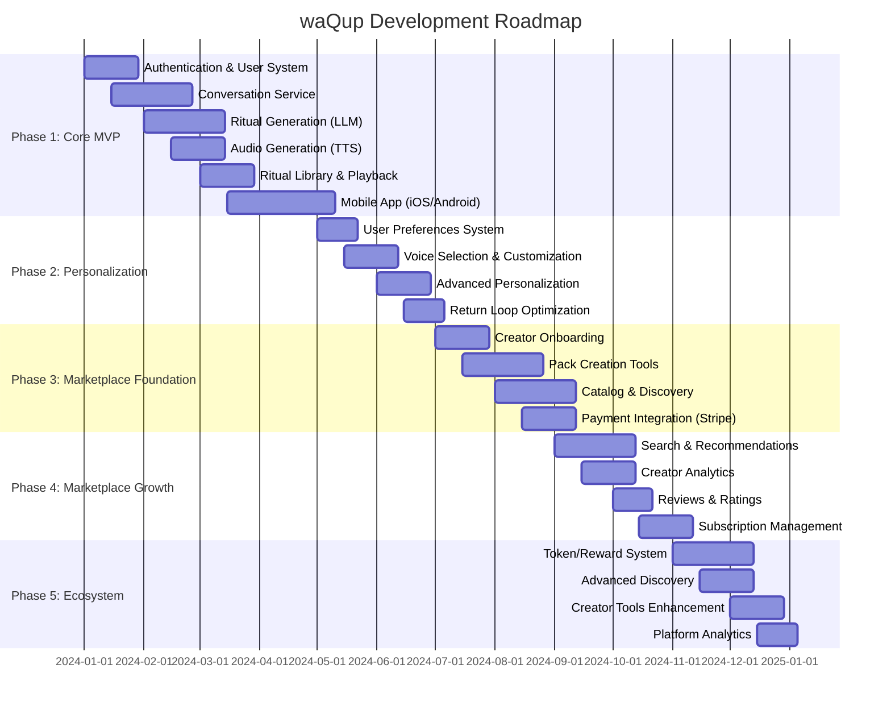

# Roadmap & Releases

**Domain**: WHEN things ship and current development status

**Related SSOT Documents**:
- All other SSOT documents: This roadmap references features and systems defined in other documents

---

## Table of Contents

- [Overview](#overview)
- [Development Phases](#development-phases)
- [Phase 1: Core MVP](#phase-1-core-mvp-months-1-4)
- [Phase 2: Personalization](#phase-2-personalization-months-5-6)
- [Phase 3: Marketplace Foundation](#phase-3-marketplace-foundation-months-7-8)
- [Phase 4: Marketplace Growth](#phase-4-marketplace-growth-months-9-10)
- [Phase 5: Ecosystem](#phase-5-ecosystem-months-11-12)
- [Post-Launch Roadmap](#post-launch-roadmap)
- [Development Principles](#development-principles)
- [Risk Mitigation](#risk-mitigation)
- [Success Metrics](#success-metrics)
- [Open Questions](#open-questions)

---

## Overview

This roadmap outlines the development phases for waQup, from initial MVP to a sustainable marketplace platform. The timeline is organized into phases that build upon each other, ensuring core functionality is solid before expanding into marketplace features.

## Development Phases

## Phase 1: Core MVP (Months 1-4)

### Goal
Build the foundational voice-first ritual creation and practice system.

### Key Features

**1. Authentication & User System (Weeks 1-4)**
- User registration and login
- JWT authentication
- User profile management
- Basic preferences storage

**2. Conversation Service (Weeks 2-7)**
- WebSocket-based real-time conversation
- State machine implementation
- Intent extraction and context gathering
- Conversation history storage

**3. Ritual Generation (Weeks 5-10)**
- LLM integration (OpenAI/Anthropic)
- Ritual text generation
- Personalization logic
- Ritual storage in database

**4. Audio Generation (Weeks 7-10)**
- TTS integration (ElevenLabs/PlayHT)
- Audio file generation
- S3 storage integration
- CDN distribution setup

**5. Ritual Library & Playback (Weeks 11-14)**
- Ritual library management
- Audio playback (Web Audio API)
- Practice event tracking
- Basic return loop

**6. Mobile App (Weeks 12-19)**
- React Native setup
- Core UI components
- Conversation interface
- Audio playback
- Ritual library

### Success Criteria
- Users can create rituals through conversation
- Rituals are generated as personalized audio
- Users can save and replay rituals
- Mobile app functional on iOS and Android
- Core user journey complete

### Technical Milestones
- API Gateway operational
- Core services deployed
- Database schema implemented
- Basic monitoring and logging
- CI/CD pipeline established

## Phase 2: Personalization (Months 5-6)

### Goal
Enhance personalization and optimize the return loop experience.

### Key Features

**1. User Preferences System (Weeks 17-19)**
- Voice preferences
- Pace preferences
- Tone preferences
- Practice goals (user-defined)

**2. Voice Selection & Customization (Weeks 20-23)**
- Multiple voice options
- Voice preview functionality
- Custom voice characteristics
- Voice switching in rituals

**3. Advanced Personalization (Weeks 24-27)**
- Context-aware personalization
- Practice history integration
- Adaptive ritual structure
- Personalized recommendations

**4. Return Loop Optimization (Weeks 28-30)**
- Improved library interface
- Practice history visualization
- Ritual organization (tags, folders)
- Export functionality

### Success Criteria
- Users can customize voice and preferences
- Personalization improves ritual relevance
- Return loop supports habit formation
- User satisfaction increases

### Technical Milestones
- Preference system integrated
- Voice selection UI/UX polished
- Personalization algorithms refined
- Performance optimizations

## Phase 3: Marketplace Foundation (Months 7-8)

### Goal
Build the foundation for creator marketplace.

### Key Features

**1. Creator Onboarding (Weeks 29-32)**
- Creator registration
- Creator profile setup
- Verification process
- Creator dashboard

**2. Pack Creation Tools (Weeks 30-35)**
- Pack creation interface
- Ritual organization in packs
- Pricing setup (free, one-time, subscription)
- Pack publishing workflow

**3. Catalog & Discovery (Weeks 33-38)**
- Pack catalog interface
- Basic search functionality
- Category browsing
- Pack detail pages

**4. Payment Integration (Weeks 36-39)**
- Stripe integration
- Checkout flow
- Subscription management
- Revenue distribution

### Success Criteria
- Creators can publish packs
- Users can discover and purchase packs
- Payment processing works smoothly
- Basic marketplace operational

### Technical Milestones
- Creator service implemented
- Catalog service with search
- Stripe integration complete
- Payment webhooks handling

## Phase 4: Marketplace Growth (Months 9-10)

### Goal
Enhance marketplace discovery and creator tools.

### Key Features

**1. Search & Recommendations (Weeks 39-44)**
- Advanced search (Elasticsearch)
- Personalized recommendations
- Trending algorithms
- Filter and sort options

**2. Creator Analytics (Weeks 40-43)**
- Pack performance metrics
- Revenue tracking
- User engagement data
- Creator dashboard enhancements

**3. Reviews & Ratings (Weeks 45-47)**
- User review system
- Rating display
- Review moderation
- Creator feedback

**4. Subscription Management (Weeks 46-49)**
- Subscription dashboard
- Cancel/upgrade flows
- Billing history
- Renewal notifications

### Success Criteria
- Users can effectively discover packs
- Creators have insights into performance
- Reviews help users make decisions
- Subscription management is smooth

### Technical Milestones
- Elasticsearch integration
- Recommendation algorithms
- Analytics dashboard
- Review system implemented

## Phase 5: Ecosystem (Months 11-12)

### Goal
Build token/reward system and enhance platform ecosystem.

### Key Features

**1. Token/Reward System (Weeks 49-54)**
- Token distribution logic
- Reward calculation
- Token balance tracking
- Reward redemption (premium features)

**2. Advanced Discovery (Weeks 50-53)**
- Curated collections
- Creator following
- Personalized feed
- Discovery algorithms refinement

**3. Creator Tools Enhancement (Weeks 54-57)**
- Advanced pack editing
- Bulk operations
- Creator collaboration tools
- Enhanced analytics

**4. Platform Analytics (Weeks 55-57)**
- Platform-wide metrics
- User growth tracking
- Marketplace health indicators
- Business intelligence dashboard

### Success Criteria
- Token system recognizes contribution
- Discovery supports organic growth
- Creators have advanced tools
- Platform metrics inform decisions

### Technical Milestones
- Reward service implemented
- Advanced discovery features
- Creator tools enhanced
- Analytics platform operational

## Post-Launch Roadmap

### Year 2 Priorities

**Q1: Internationalization**
- Multi-language support
- Localized TTS voices
- Currency conversion
- Regional payment methods

**Q2: Advanced Features**
- Ritual sequences
- Group practices (optional)
- Advanced personalization
- Biometric integration (with consent)

**Q3: Platform Expansion**
- Web app enhancements
- Desktop app (Electron)
- API for third-party integrations
- White-label solutions

**Q4: Community Building**
- Creator community features
- User forums (optional)
- Educational resources
- Certification programs

## Development Principles

### Iterative Development
- Build MVP first, then iterate
- User feedback drives priorities
- Continuous improvement mindset
- Data-informed decisions

### Quality First
- Comprehensive testing (unit, integration, E2E)
- Code reviews for all changes
- Performance monitoring
- Security audits

### User-Centric
- User research informs features
- Regular user testing
- Feedback loops integrated
- Respect for user autonomy

### Regenerative Growth
- Sustainable development pace
- No rush to market
- Trust-based feature releases
- Long-term thinking

## Risk Mitigation

### Technical Risks
- **LLM/TTS Costs**: Monitor usage, optimize calls, consider alternatives
- **Scalability**: Design for scale from start, load testing
- **Audio Quality**: Test TTS providers, fallback options
- **Mobile Performance**: Optimize audio playback, battery usage

### Product Risks
- **User Adoption**: Focus on core value, word-of-mouth growth
- **Creator Engagement**: Provide value, sustainable economics
- **Market Fit**: Validate assumptions, iterate based on feedback
- **Competition**: Focus on unique value proposition

### Business Risks
- **Revenue Model**: Validate pricing, creator economics
- **Regulatory**: GDPR compliance, medical claims boundaries
- **Dependency**: Avoid over-reliance on external services
- **Sustainability**: Ensure regenerative economics

## Success Metrics

### Phase 1 (MVP)
- 1,000+ users create rituals
- 10,000+ rituals generated
- 5,000+ practice sessions
- < 200ms API response time (p95) for standard endpoints

### Phase 2 (Personalization)
- 50%+ users customize preferences
- 30%+ improvement in ritual relevance
- 40%+ return rate (users practicing regularly)

### Phase 3 (Marketplace Foundation)
- 50+ creators onboarded
- 100+ packs published
- 1,000+ pack purchases
- $10,000+ creator revenue

### Phase 4 (Marketplace Growth)
- 10,000+ active users
- 500+ packs available
- 4.5+ average pack rating
- $50,000+ monthly creator revenue

### Phase 5 (Ecosystem)
- 100,000+ active users
- 1,000+ creators
- Sustainable token circulation
- Platform profitability

## Open Questions

1. **Timeline Flexibility**: Should phases be adjusted based on early user feedback?
2. **Feature Prioritization**: Which marketplace features are most critical?
3. **International Expansion**: When should we prioritize multi-language support?
4. **Creator Incentives**: What additional tools do creators need most?
5. **Token System**: Should token system launch earlier or later?
6. **Platform Expansion**: When should we consider web/desktop apps?
7. **Partnerships**: Should we pursue partnerships with wellness platforms?
8. **Research**: When should we invest in scientific validation studies?

