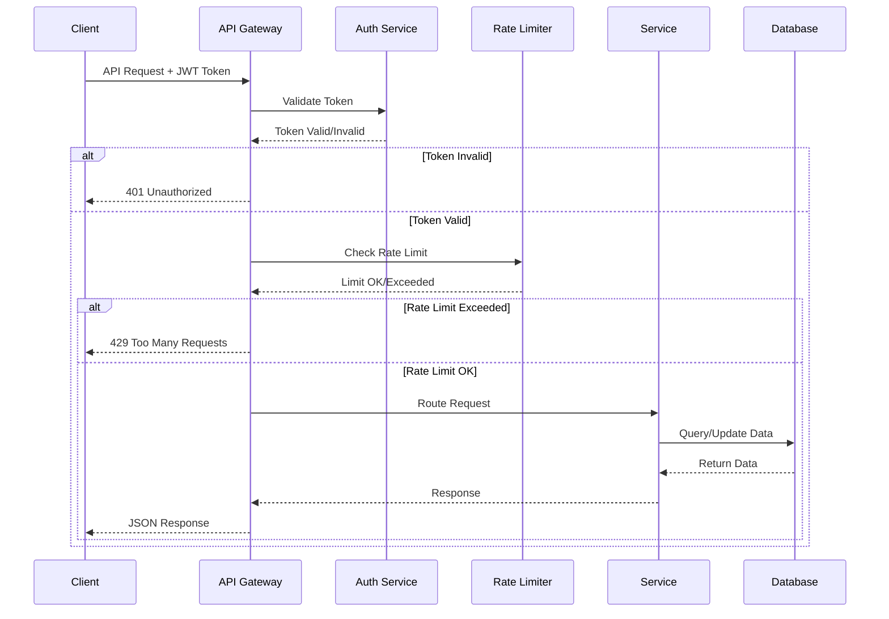
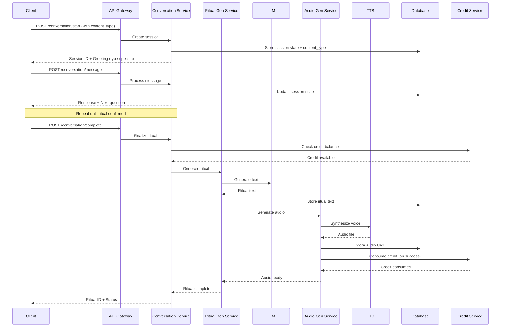
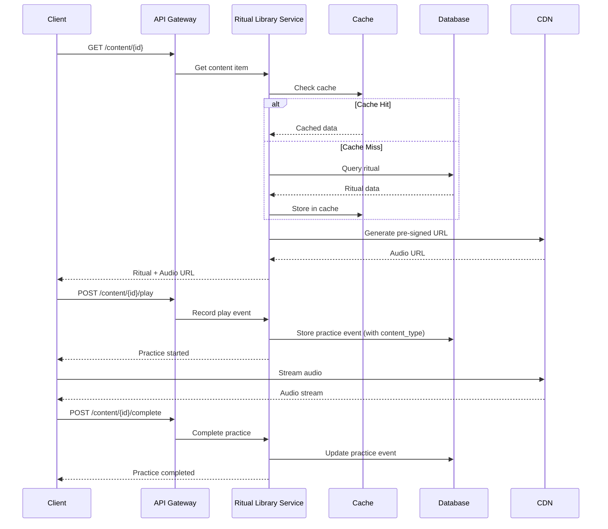
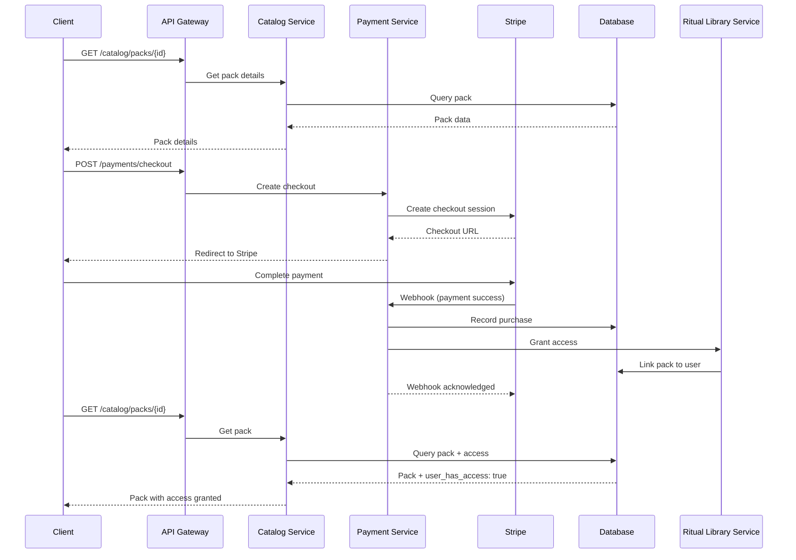

# API Flow

> **⚠️ Archived Reference Document**  
> This document is kept for historical reference. The complete, up-to-date content has been merged into the **[System Architecture](./waqup_system_architecture.html#api-flow)** document.

**Domain**: HOW waQup's APIs work (endpoints, flows, design principles)

---

**Related SSOT Documents**:
- Content Types & Taxonomy: Content type definitions and API filtering
- Architecture Overview: System architecture and service design (complementary)
- Credits System: Credit API endpoints and consumption flows
- Data Flow: Data movement patterns through APIs

## API Architecture Overview

waQup uses a RESTful API architecture with WebSocket support for real-time conversation flows. All APIs are versioned, authenticated via JWT, and follow consistent patterns for error handling, rate limiting, and response formatting.

## API Gateway Flow



## Core API Endpoints

### Authentication APIs

**POST /api/v1/auth/register**
```json
Request:
{
  "email": "user@example.com",
  "password": "securepassword"
}

Response:
{
  "token": "jwt_token_here",
  "refresh_token": "refresh_token_here",
  "user": {
    "id": "uuid",
    "email": "user@example.com"
  }
}
```

**POST /api/v1/auth/login**
```json
Request:
{
  "email": "user@example.com",
  "password": "securepassword"
}

Response:
{
  "token": "jwt_token_here",
  "refresh_token": "refresh_token_here",
  "user": {
    "id": "uuid",
    "email": "user@example.com"
  }
}
```

**POST /api/v1/auth/refresh**
```json
Request:
{
  "refresh_token": "refresh_token_here"
}

Response:
{
  "token": "new_jwt_token_here"
}
```

### Conversation APIs

**WebSocket: /ws/conversation**
```javascript
// Connect
ws://api.waqup.com/ws/conversation?token=jwt_token

// Send message
{
  "type": "message",
  "content": "I need something to help me sleep",
  "session_id": "session_uuid"
}

// Receive response
{
  "type": "response",
  "content": "I'd be happy to help you create a ritual for sleep...",
  "state": "IntentDiscovery",
  "session_id": "session_uuid"
}
```

**POST /api/v1/conversation/start**
```json
Request:
{
  "content_type": "affirmation" | "guided_meditation" | "ritual",
  "intent": "sleep" // optional, can be discovered through conversation
}

Response:
{
  "session_id": "uuid",
  "content_type": "ritual",
  "state": "Greeting",
  "message": "Hello! I'd be happy to help you create a personalized ritual..."
}
```

**POST /api/v1/conversation/message**
```json
Request:
{
  "session_id": "uuid",
  "message": "I want something calming for evening"
}

Response:
{
  "session_id": "uuid",
  "state": "ContextGathering",
  "response": "That sounds wonderful. When would you like to practice this?",
  "context": {
    "intent": "calming",
    "time_preference": null
  }
}
```

**GET /api/v1/conversation/state**
```json
Response:
{
  "session_id": "uuid",
  "state": "PracticeDetails",
  "context": {
    "intent": "calming",
    "time_preference": "evening",
    "duration": "10 minutes"
  },
  "messages": [...]
}
```

**POST /api/v1/conversation/complete**
```json
Request:
{
  "session_id": "uuid",
  "confirm": true
}

Response:
{
  "ritual_id": "uuid",
  "status": "generating",
  "estimated_time": 30 // seconds
}
```

### Content APIs (Affirmations, Guided Meditations, Rituals)

**GET /api/v1/content**
```json
Query Parameters:
- content_type: "affirmation" | "guided_meditation" | "ritual" | null (all)
- page: number (default: 1)
- limit: number (default: 20)
- tags: string[] (optional)
- depth: "shallow" | "medium" | "deep" | null (all)

Response:
{
  "content_items": [
    {
      "id": "uuid",
      "content_type": "ritual",
      "title": "Evening Calm",
      "depth": "deep",
      "duration": 600,
      "tags": ["evening", "calming"],
      "created_at": "2024-01-01T00:00:00Z",
      "last_played_at": "2024-01-15T10:30:00Z",
      "play_count": 12
    }
  ],
  "pagination": {
    "page": 1,
    "limit": 20,
    "total": 45,
    "pages": 3
  }
}
```

**GET /api/v1/content/{id}**
```json
Response:
{
  "id": "uuid",
  "content_type": "ritual",
  "title": "Evening Calm",
  "content_text": "Find a comfortable position...",
  "depth": "deep",
  "duration": 600,
  "tags": ["calming", "evening", "breath"],
  "voice": {
    "id": "uuid",
    "name": "Calm Guide"
  },
  "audio_url": "https://cdn.waqup.com/audio/...",
  "created_at": "2024-01-01T00:00:00Z",
  "structure": {...},
  "context": {...}
}
```

**POST /api/v1/content/{id}/play**
```json
Request:
{
  "started_at": "2024-01-15T10:30:00Z"
}

Response:
{
  "practice_event_id": "uuid",
  "status": "started"
}
```

**POST /api/v1/content/{id}/complete**
```json
Request:
{
  "practice_event_id": "uuid",
  "completed_at": "2024-01-15T10:40:00Z",
  "duration": 600
}

Response:
{
  "practice_event_id": "uuid",
  "status": "completed"
}
```

**DELETE /api/v1/content/{id}**
```json
Response:
{
  "status": "deleted",
  "content_item_id": "uuid"
}
```

**GET /api/v1/content/{id}/export**
```json
Query Parameters:
- format: "text" | "audio" | "both"

Response:
{
  "text": "Find a comfortable position...",
  "audio_url": "https://cdn.waqup.com/audio/...",
  "exported_at": "2024-01-15T10:45:00Z"
}
```

### Marketplace APIs

**GET /api/v1/catalog/packs**
```json
Query Parameters:
- page: number
- limit: number
- search: string
- tags: string[]
- creator_id: uuid
- price_type: "free" | "one_time" | "subscription"

Response:
{
  "packs": [
    {
      "id": "uuid",
      "title": "Morning Energy Pack",
      "description": "Start your day with intention...",
      "creator": {
        "id": "uuid",
        "name": "Sarah Facilitator"
      },
      "price_type": "subscription",
      "price_amount": 9.99,
      "subscription_interval": "monthly",
      "ritual_count": 5,
      "rating": 4.8,
      "review_count": 127
    }
  ],
  "pagination": {...}
}
```

**GET /api/v1/catalog/packs/{id}**
```json
Response:
{
  "id": "uuid",
  "title": "Morning Energy Pack",
  "description": "Start your day with intention...",
  "creator": {...},
  "rituals": [
    {
      "id": "uuid",
      "title": "Sunrise Breath",
      "duration": 300,
      "practice_type": "breath_work"
    }
  ],
  "price_type": "subscription",
  "price_amount": 9.99,
  "user_has_access": false
}
```

**GET /api/v1/catalog/recommendations**
```json
Response:
{
  "recommendations": [
    {
      "pack_id": "uuid",
      "reason": "Based on your practice history",
      "score": 0.85
    }
  ]
}
```

**POST /api/v1/payments/checkout**
```json
Request:
{
  "pack_id": "uuid",
  "price_type": "subscription",
  "success_url": "https://app.waqup.com/success",
  "cancel_url": "https://app.waqup.com/cancel"
}

Response:
{
  "checkout_url": "https://checkout.stripe.com/...",
  "session_id": "stripe_session_id"
}
```

**POST /api/v1/payments/webhook**
```json
// Stripe webhook handler (internal)
Request:
{
  "type": "checkout.session.completed",
  "data": {
    "object": {
      "id": "stripe_session_id",
      "metadata": {
        "pack_id": "uuid",
        "user_id": "uuid"
      }
    }
  }
}
```

### User APIs

**GET /api/v1/users/me**
```json
Response:
{
  "id": "uuid",
  "email": "user@example.com",
  "preferences": {
    "voice_id": "uuid",
    "pace": "moderate",
    "tone": "warm"
  },
  "created_at": "2024-01-01T00:00:00Z"
}
```

**PUT /api/v1/users/me**
```json
Request:
{
  "preferences": {
    "voice_id": "new_voice_id",
    "pace": "slower"
  }
}

Response:
{
  "id": "uuid",
  "preferences": {
    "voice_id": "new_voice_id",
    "pace": "slower",
    "tone": "warm"
  }
}
```

**GET /api/v1/users/me/history**
```json
Query Parameters:
- page: number
- limit: number
- ritual_id: uuid (optional)

Response:
{
  "practice_events": [
    {
      "id": "uuid",
      "ritual_id": "uuid",
      "ritual_title": "Evening Calm",
      "started_at": "2024-01-15T10:30:00Z",
      "completed_at": "2024-01-15T10:40:00Z",
      "duration": 600
    }
  ],
  "pagination": {...}
}
```

### Credit APIs

**GET /api/v1/credits/balance**
```json
Response:
{
  "balance": 5,
  "free_tier_used": true,
  "last_transaction_at": "2024-01-15T10:30:00Z"
}
```

**GET /api/v1/credits/transactions**
```json
Query Parameters:
- page: number
- limit: number
- transaction_type: "purchase" | "consumption" | "refund" (optional)

Response:
{
  "transactions": [
    {
      "id": "uuid",
      "type": "consumption",
      "amount": -1,
      "balance_after": 4,
      "ritual_id": "uuid",
      "created_at": "2024-01-15T10:30:00Z"
    },
    {
      "id": "uuid",
      "type": "purchase",
      "amount": 10,
      "balance_after": 11,
      "pack_id": "seeker",
      "created_at": "2024-01-10T08:00:00Z"
    }
  ],
  "pagination": {...}
}
```

**POST /api/v1/credits/purchase**
```json
Request:
{
  "pack_type": "starter" | "seeker" | "architect",
  "success_url": "https://app.waqup.com/success",
  "cancel_url": "https://app.waqup.com/cancel"
}

Response:
{
  "checkout_url": "https://checkout.stripe.com/...",
  "session_id": "stripe_session_id",
  "credits_amount": 3
}
```

**POST /api/v1/credits/check**
```json
Request:
{
  "action": "ritual_creation",
  "ritual_id": "uuid" // optional, for modifications
}

Response:
{
  "sufficient": true,
  "balance": 5,
  "required": 1,
  "message": "You have sufficient credits"
}
```

## API Flow Diagrams

### Ritual Creation Flow



### Ritual Playback Flow



### Marketplace Purchase Flow



## API Design Principles

### RESTful Design
- Standard HTTP methods (GET, POST, PUT, DELETE)
- Resource-based URLs (`/rituals/{id}`)
- Consistent response formats
- Proper HTTP status codes

### Versioning
- URL-based versioning (`/api/v1/...`)
- Backward compatibility maintained
- Deprecation notices for old versions

### Authentication
- JWT tokens for stateless auth
- Refresh token rotation
- Token expiration (15 minutes access, 7 days refresh)

### Rate Limiting
- Per-user rate limits
- Tiered limits (free vs. paid users)
- 429 status code with retry-after header

### Error Handling
```json
{
  "error": {
    "code": "RITUAL_NOT_FOUND",
    "message": "Ritual with ID {id} not found",
    "details": {...}
  }
}
```

### Pagination
```json
{
  "data": [...],
  "pagination": {
    "page": 1,
    "limit": 20,
    "total": 100,
    "pages": 5,
    "has_next": true,
    "has_prev": false
  }
}
```

## API Performance

### Caching Strategy
- Redis cache for frequently accessed data
- Cache TTL: 15 minutes (user profiles), 1 hour (ritual metadata)
- CDN cache for audio files (long TTL)

### Async Processing
- Audio generation via message queue
- LLM calls can be async for non-real-time flows
- Webhook processing async

### Response Times
- API responses: < 200ms (p95)
- Audio generation: < 30s (async)
- Ritual generation: < 10s (LLM call)

## API Security

### Input Validation
- Schema validation for all requests
- SQL injection prevention
- XSS prevention
- Rate limiting

### Data Protection
- No sensitive data in URLs
- Pre-signed URLs for audio (time-limited)
- Encryption at rest and in transit
- GDPR compliance

### Monitoring
- Request logging (structured JSON)
- Error tracking
- Performance monitoring
- Security event logging

