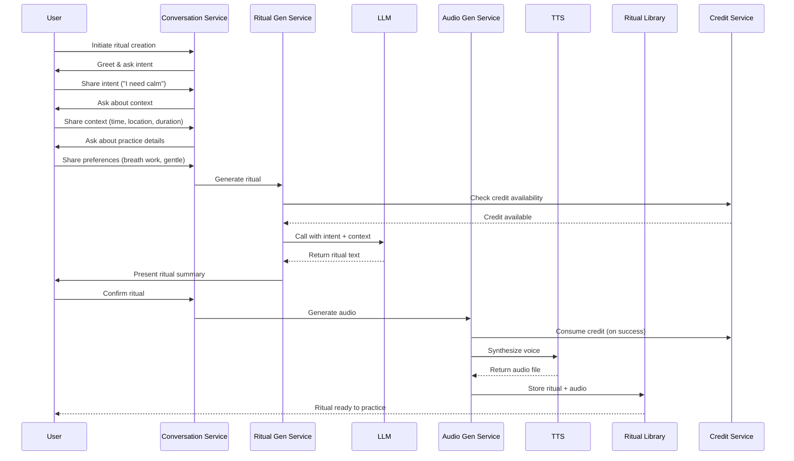
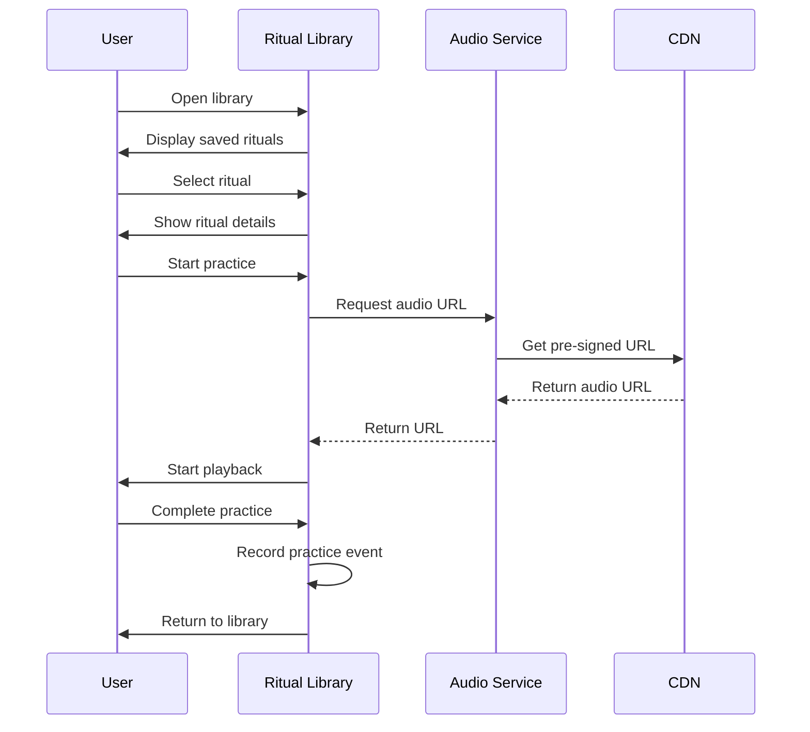
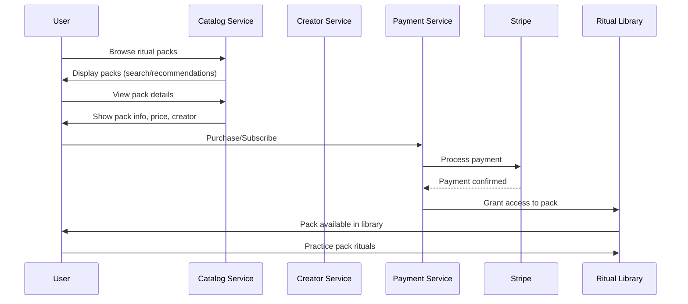
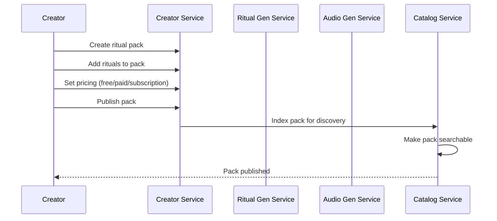

# Features & Workflows

> **⚠️ Archived Reference Document**  
> This document is kept for historical reference. The complete, up-to-date content has been merged into the **[Conversational & Ritual System](./waqup_conversational_and_ritual_system.html)** document.

**Domain**: WHAT waQup does (features) and HOW users interact (workflows)

---

**Related SSOT Documents**:
- Content Types & Taxonomy: Three content types (affirmations, meditations, rituals) and taxonomy system
- Product Constitution: WHAT waQup is (identity, invariants, boundaries)
- Conversational & Ritual System: Detailed state machine and content creation lifecycle
- Credits System: HOW credits manage AI resource consumption
- Value & Growth Economy: Token/reward system mechanics
- Scientific Foundations: WHY embodied practice and voice-first design work
- AI Voice & Ethics: HOW waQup speaks and behaves ethically

## Core Features

### 1. Voice-First Content Creation
Users create personalized content (affirmations, guided meditations, or rituals) through guided conversation, not forms. The system uses natural language dialogue to understand intent, gather context, and generate customized practices.

**Three Content Types** (see Content Types & Taxonomy document):
- **Affirmations**: Cognitive re-patterning (0.5 credits)
- **Guided Meditations**: State induction (1 credit)
- **Rituals**: Identity encoding (1 credit)

**Key Characteristics**:
- Conversational interface (no forms or configuration screens)
- Natural language understanding
- Adaptive dialogue flow (adapts to content type)
- Real-time conversation via WebSocket
- Credit-based creation (cost varies by type, see Credits System document)
- Type selection before creation (user chooses depth)

### 2. Embodied Practice Content
All content types (affirmations, guided meditations, rituals) engage the body, though to different depths. Rituals and guided meditations emphasize embodied practice more than affirmations.

**Practice Types** (for meditations and rituals):
- Breath work (various techniques)
- Body scanning and awareness
- Gentle movement and stretching
- Sensory awareness practices
- Combination practices

**Note**: Affirmations focus on linguistic encoding; meditations and rituals include embodied practice.

### 3. Personalized Audio Generation
Rituals are generated as personalized audio files using LLM for text generation and TTS for voice synthesis.

**Personalization Elements**:
- Voice selection (user preference)
- Pace (slower for calming, moderate for energy)
- Tone (warm, supportive, matches intent)
- Ritual structure (adapted to duration and practice type)

### 4. Content Library & Return Loops
Users save content (affirmations, guided meditations, rituals) and return to practice them regularly. No gamification—users return for intrinsic value.

**Library Features**:
- Save unlimited personal content (all types)
- Organize by type (affirmations, meditations, rituals)
- Organize by tags (flexible tagging system)
- Organize in folders (user-created collections)
- Track practice history (for reference, not gamification)
- Export content (text and audio)
- Offline playback support
- **Unlimited replay** (practice is free, no credit consumption)

**Library Organization**:
- Filter by content type
- Filter by tags
- Filter by depth (shallow, medium, deep)
- Browse by collection (folders, packs, sequences)

### 5. Marketplace & Creator Ecosystem
Facilitators/creators publish ritual packs and custom voices. Users discover, purchase, and subscribe to creator content.

**Marketplace Features**:
- Browse and search ritual packs
- One-time purchases and subscriptions
- Creator profiles and follow functionality
- Personalized recommendations
- Reviews and ratings

### 6. Credits System
Resource management system for AI generation. Credits enable intentional creation while managing infrastructure costs.

**Key Principles**:
- Credits consumed only for creation/transformation (not practice)
- Credits never expire (no FOMO)
- Practice is free (unlimited replay)
- Transparent costs and balance

**Note**: For detailed credits mechanics, consumption rules, and pricing, see Credits System document.

### 7. Token/Reward System
Non-speculative recognition system for user and creator contributions. Tokens represent value exchange, not investment.

**Reward Types**:
- Practice tokens (for regular engagement)
- Creator tokens (for quality packs)
- Referral tokens (for word-of-mouth)
- Feedback tokens (for constructive feedback)

**Note**: For detailed token mechanics, distribution rules, and economic model, see Value & Growth Economy document.

## Ritual Creation Workflow

### Workflow States

1. **Greeting**: System welcomes user and explains the process
2. **Intent Discovery**: System asks what kind of practice would support the user
3. **Context Gathering**: System asks about time, location, duration, current state
4. **Practice Details**: System asks about practice type, body engagement, intensity, guidance style
5. **Personalization**: System applies voice, pace, tone, and structure preferences
6. **Confirmation**: System presents ritual summary for user approval
7. **Generation**: System generates ritual text (LLM) and audio (TTS)
8. **Complete**: Ritual is saved and ready to practice

**Note**: For detailed state machine implementation and conversational system architecture, see Conversational & Ritual System document.

## Return Loop Workflow

### Return Loop States

1. **Library**: User views saved rituals
2. **Ritual Selection**: User selects a ritual to practice
3. **Preview**: User reviews ritual details
4. **Personalization Check**: System checks if update needed (optional)
5. **Playing**: Audio playback begins
6. **Paused**: User can pause and resume
7. **Complete**: Practice finished, return to library

## Marketplace Workflow

### Creator Publishing Workflow

## Key Workflow Principles

### No Gamification
- No streaks, badges, or achievements
- No comparison with other users
- No external rewards or punishments
- Users return for intrinsic value

### User Autonomy
- Users control their practice
- No pressure to return
- No consequences for not practicing
- Easy exit (export, delete account)

### Conversation Over Forms
- All ritual creation happens through dialogue
- Natural, adaptive conversation flow
- No static forms or configuration screens
- Context-aware personalization

### Voice-First Design
- All core interactions via voice
- Text and visual interfaces are secondary
- Audio is primary delivery mechanism
- Supports nervous system regulation through voice prosody (see Scientific Foundations document for research basis)

## Feature Boundaries

### What waQup Does
- Creates personalized voice-guided rituals
- Supports embodied practice through conversation
- Provides marketplace for creator content
- Enables habit formation through return loops
- Recognizes contribution through tokens

### What waQup Never Does
- Gamifies practice (no streaks, badges, leaderboards)
- Creates dependency (no withdrawal mechanics)
- Manipulates users (no FOMO, urgency, pressure)
- Claims medical benefits (not a therapy tool)
- Tracks users invasively (minimal data collection)
- Creates social comparison (not a social network)

