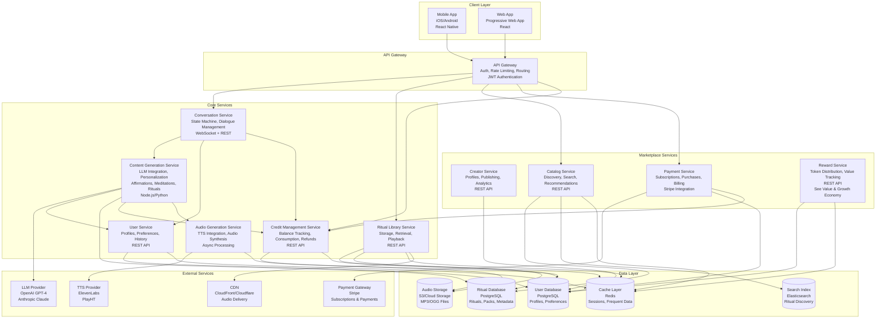
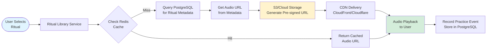
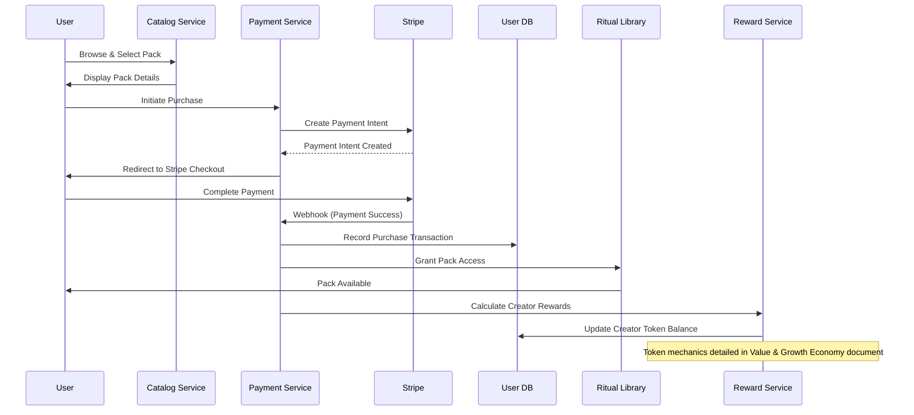
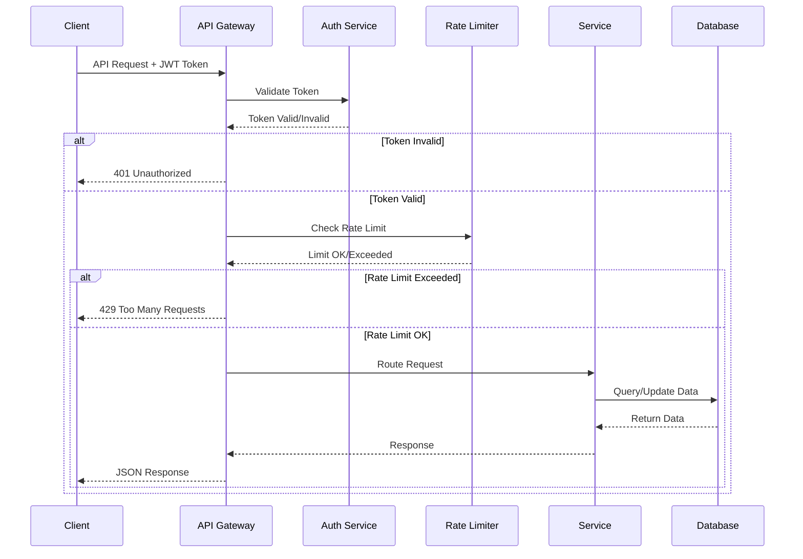
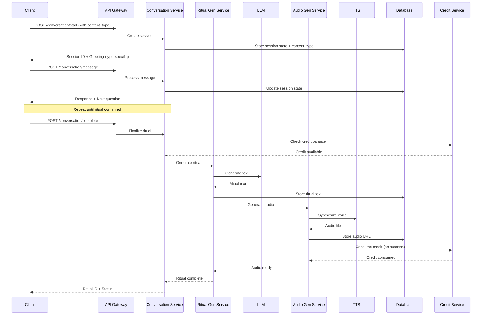
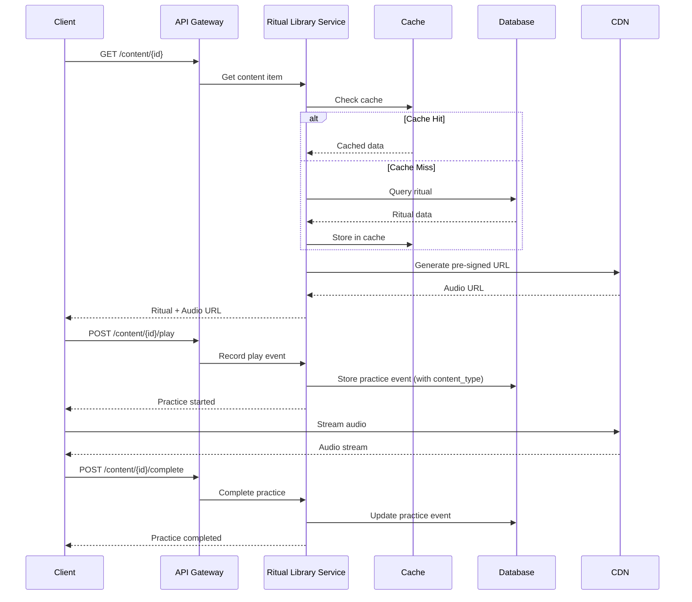
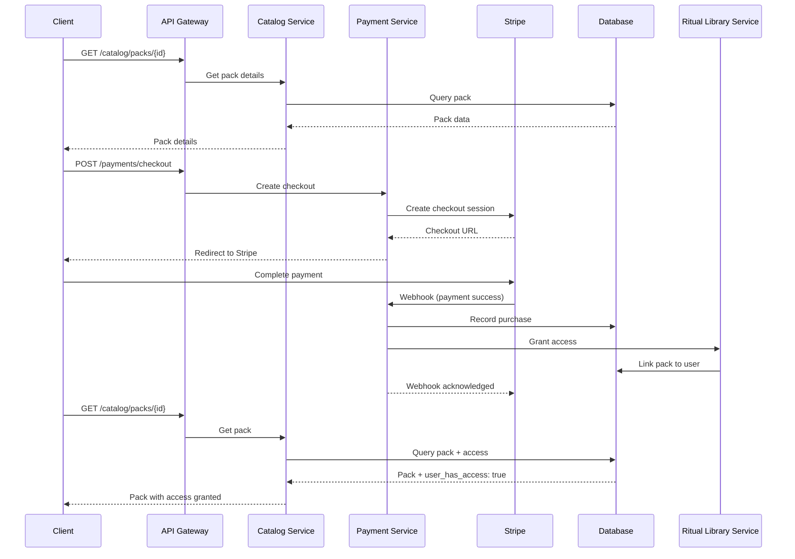

# System Architecture

**Domain**: HOW waQup is built (full stack, APIs, infrastructure, deployment)

**Related SSOT Documents**:
- [Product Constitution](./product-constitution.html): WHAT waQup is
- [Value & Growth Economy](./value-and-growth-economy.html): HOW value circulates
- [Conversational & Ritual System](./conversational-and-ritual-system.html): HOW humans interact
- [AI Voice & Ethics](./ai-voice-and-ethics.html): HOW waQup speaks

---

## Table of Contents

- [Architecture Overview](#architecture-overview)
- [System Architecture](#system-architecture)
- [Technology Stack](#technology-stack)
- [Core Services Architecture](#core-services-architecture)
- [Data Flow](#data-flow)
- [API Flow](#api-flow)
- [Data Architecture](#data-architecture)
- [Security Architecture](#security-architecture)
- [Scalability Strategy](#scalability-strategy)
- [Deployment Architecture](#deployment-architecture)
- [Observability](#observability)

---

## Architecture Overview

> This section covers the high-level system architecture. For detailed data flows, see [Data Flow](#data-flow). For API specifications, see [API Flow](#api-flow).

## System Architecture

waQup is built as a cloud-native, microservices-oriented platform optimized for voice-first interactions, real-time conversation, and audio generation/streaming. The system prioritizes low-latency voice interactions, reliable audio delivery, and scalable ritual generation.

## High-Level Architecture Diagram



## Technology Stack

### Backend
- **Runtime**: Node.js (TypeScript) or Python (FastAPI)
- **API Framework**: Express.js / FastAPI
- **API Protocol**: REST + WebSocket (for real-time conversation)
- **Database**: PostgreSQL (primary data store)
- **Cache**: Redis (session state, frequently accessed data)
- **Search**: Elasticsearch (ritual discovery, full-text search)
- **Message Queue**: RabbitMQ / AWS SQS (async job processing)
- **Object Storage**: AWS S3 / Google Cloud Storage (audio files)

### Frontend
- **Mobile**: React Native (iOS/Android)
- **Web**: React (Progressive Web App)
- **State Management**: Zustand / Redux Toolkit
- **Audio Playback**: Web Audio API / React Native Audio
- **Real-time**: WebSocket client

### Infrastructure
- **Hosting**: AWS / Google Cloud Platform
- **Containerization**: Docker
- **Orchestration**: Kubernetes / ECS
- **CI/CD**: GitHub Actions / GitLab CI
- **Monitoring**: Datadog / New Relic / Prometheus + Grafana
- **Logging**: ELK Stack / CloudWatch
- **CDN**: CloudFront / Cloudflare (audio delivery)

## Core Services Architecture

### Conversation Service
Manages the state machine for ritual creation and return loops. Handles dialogue flow, context management, and user intent extraction.

**Key Responsibilities**:
- Maintain conversation state per user session
- Route user inputs to appropriate handlers
- Extract intent and context from natural language
- Coordinate with Ritual Generation Service
- Manage ephemeral vs. persistent conversation data

### Content Generation Service
Generates personalized content (affirmations, guided meditations, rituals) using LLM based on user conversation and context.

**Key Responsibilities**:
- Validate credit availability before generation (via Credit Management Service)
- Adapt generation logic based on content type (affirmation, meditation, ritual)
- Call LLM with user intent, conversation history, and content type
- Apply type-specific structure (affirmations: statements, meditations: state induction, rituals: identity encoding)
- Apply personalization rules based on user profile and history
- Structure content according to waQup format (type-specific)
- Trigger audio generation after text generation
- Consume credit on successful completion (cost varies by type)
- Store generated content in database (with content_type)
- Request credit refund on generation failure

### Audio Generation Service
Converts ritual text to audio using TTS, applies voice characteristics, and stores audio files.

**Key Responsibilities**:
- Call TTS API with ritual text and voice selection
- Apply voice characteristics (pace, tone, pauses)
- Store generated audio in object storage
- Generate audio metadata (duration, format, quality)
- Handle audio format conversion and optimization

### Ritual Library Service
Manages user's saved rituals, playback, and ritual history.

**Key Responsibilities**:
- Store and retrieve user's ritual library
- Track playback history and practice frequency
- Provide audio streaming URLs
- Handle ritual sharing and export
- Manage ritual organization (tags, folders)
- Free unlimited replay (no credit consumption)

### Credit Management Service
Manages user credit balances, consumption, and refunds.

**Key Responsibilities**:
- Track credit balance per user
- Validate credit availability before consumption
- Process credit consumption on successful ritual creation
- Handle credit refunds on system errors
- Record credit transaction history
- Integrate with Payment Service for credit purchases
- Provide credit balance API endpoints


## Data Flow

waQup's data flow architecture ensures efficient, secure, and scalable handling of user data, ritual generation, audio processing, and marketplace transactions. Data flows through multiple layers: client, API gateway, services, data stores, and external integrations.

## Ritual Creation Data Flow


## Audio Playback Data Flow



## Marketplace Purchase Data Flow



## Data Storage Architecture

### Persistent Storage (PostgreSQL)

**Users Table**:
```
- id (UUID, primary key)
- email (string, unique)
- created_at (timestamp)
- preferences (JSONB: voice, pace, tone preferences)
- practice_history_summary (JSONB: total practices, last practice)
- credit_balance (integer, default: 1 for free tier)
```

**Credit Transactions Table**:
```
- id (UUID, primary key)
- user_id (UUID, foreign key)
- transaction_type (enum: purchase, consumption, refund)
- amount (integer, credits)
- balance_after (integer)
- content_item_id (UUID, nullable, foreign key) -- replaces ritual_id
- content_type (enum: affirmation, guided_meditation, ritual, nullable)
- created_at (timestamp)
- metadata (JSONB: purchase_pack_id, refund_reason, etc.)
```

**Content Items Table** (replaces Rituals Table):
```
- id (UUID, primary key)
- user_id (UUID, foreign key)
- content_type (enum: affirmation, guided_meditation, ritual) NOT NULL
- title (string)
- content_text (text)
- voice_id (UUID, foreign key)
- audio_url (string, S3 URL)
- audio_duration (integer, seconds)
- depth (string: shallow, medium, deep) -- system-assigned
- tags (TEXT[] array)
- structure (JSONB: type-specific structure)
- context (JSONB: creation context, personalization)
- created_at (timestamp)
- last_played_at (timestamp)
- play_count (integer, for reference only)
- metadata (JSONB: additional metadata)
```

**Note**: See Content Types & Taxonomy document for detailed schema and type definitions.

**Ritual Packs Table**:
```
- id (UUID, primary key)
- creator_id (UUID, foreign key)
- title (string)
- description (text)
- price_type (enum: free, one_time, subscription)
- price_amount (decimal)
- subscription_interval (enum: monthly, annual)
- published_at (timestamp)
- status (enum: draft, published, archived)
```

**Conversations Table**:
```
- id (UUID, primary key)
- user_id (UUID, foreign key)
- session_id (string)
- messages (JSONB: array of messages)
- state (JSONB: state machine state)
- created_at (timestamp)
- completed_at (timestamp)
- resulting_ritual_id (UUID, nullable)
```

**Practice Events Table**:
```
- id (UUID, primary key)
- user_id (UUID, foreign key)
- ritual_id (UUID, foreign key)
- started_at (timestamp)
- completed_at (timestamp, nullable)
- duration (integer, seconds)
- metadata (JSONB: context, device)
```

### Ephemeral Storage (Redis)

**Session State**:
```
Key: session:{session_id}
Value: {
  state: "IntentDiscovery" | "ContextGathering" | ...
  context: { intent, time, location, ... }
  user_id: UUID
}
TTL: 1 hour
```

**User Profile Cache**:
```
Key: user:{user_id}:profile
Value: { preferences, voice_selection, ... }
TTL: 15 minutes
```

**Ritual Metadata Cache**:
```
Key: ritual:{ritual_id}:metadata
Value: { title, duration, audio_url, ... }
TTL: 1 hour
```

**Search Results Cache**:
```
Key: search:{query_hash}
Value: [pack_ids, ...]
TTL: 5 minutes
```

### Object Storage (S3/Cloud Storage)

**Audio Files**:
```
Path: audio/{user_id}/{ritual_id}/{version}.mp3
Format: MP3 or OGG
Retention: Permanent (until user deletion)
CDN: CloudFront/Cloudflare for delivery
```

## Data Flow Patterns

### Write Pattern (Ritual Creation)

1. **Ephemeral Data** (Redis):
   - Conversation state stored in Redis during creation
   - Fast access for state machine transitions
   - TTL: 1 hour (session timeout)

2. **Persistent Data** (PostgreSQL):
   - Ritual metadata written after generation
   - Conversation history persisted for personalization
   - Practice events recorded after completion

3. **Object Storage** (S3):
   - Audio files stored asynchronously
   - Pre-signed URLs generated for secure access
   - CDN distribution for fast delivery

### Read Pattern (Ritual Playback)

1. **Cache First** (Redis):
   - Check cache for ritual metadata
   - Check cache for audio URLs
   - Cache hit: Return immediately

2. **Database Fallback** (PostgreSQL):
   - Cache miss: Query database
   - Retrieve ritual metadata
   - Generate pre-signed S3 URL

3. **CDN Delivery** (CloudFront/Cloudflare):
   - Audio served via CDN
   - Low latency, global distribution
   - Reduced origin server load

### Search Pattern (Marketplace Discovery)

1. **Cache Check** (Redis):
   - Check cached search results
   - Return if cache hit (< 5 minutes)

2. **Search Index** (Elasticsearch):
   - Query Elasticsearch for pack matches
   - Full-text search, filtering, sorting
   - Return pack IDs

3. **Database Lookup** (PostgreSQL):
   - Fetch full pack metadata
   - Include creator information
   - Return complete results

## Data Privacy & Security

### Data Minimization
- Collect only necessary data
- No biometric data without consent
- No location data without consent
- No social connections (not a social platform)

### Data Encryption
- TLS in transit (all API calls)
- Encryption at rest (sensitive data)
- Pre-signed URLs for audio (time-limited access)
- JWT tokens for authentication

### Data Access Control
- User data isolated by user_id
- Creator data isolated by creator_id
- Role-based access control (RBAC)
- Audit logging for sensitive operations

### Data Export & Deletion
- Users can export all data (JSON format)
- Users can delete account and all data
- Audio files deleted from S3
- Database records soft-deleted or purged
- GDPR compliance

**Note**: For comprehensive security architecture details, see Architecture Overview document. For ethical data handling principles, see AI Voice & Ethics document.

## Data Flow Performance

### Optimization Strategies

1. **Caching**:
   - Aggressive caching of frequently accessed data
   - Redis for hot data (sessions, profiles, metadata)
   - CDN for static assets (audio files)

2. **Async Processing**:
   - Audio generation via message queue
   - LLM calls can be async for non-real-time flows
   - Background jobs for analytics and reporting

3. **Database Optimization**:
   - Indexed queries (user_id, ritual_id, creator_id)
   - Read replicas for read-heavy workloads
   - Connection pooling
   - Query optimization

4. **CDN Distribution**:
   - All audio delivery via CDN
   - Global edge locations
   - Reduced latency for users worldwide

## Data Flow Monitoring

### Key Metrics
- **Latency**: API response times, audio generation time
- **Throughput**: Requests per second, rituals generated per hour
- **Cache Hit Rate**: Redis cache effectiveness
- **Error Rate**: Failed requests, generation failures
- **Storage**: Database size, S3 storage usage

### Alerting
- High latency (> 1s for API calls)
- High error rate (> 1% failures)
- Cache hit rate drop (< 80%)
- Storage capacity warnings (> 80% full)
- Service downtime


## API Flow

waQup uses a RESTful API architecture with WebSocket support for real-time conversation flows. All APIs are versioned, authenticated via JWT, and follow consistent patterns for error handling, rate limiting, and response formatting.

## API Gateway Flow



## Core API Endpoints

### Authentication APIs

**POST /api/v1/auth/register**
```json
Request:
{
  "email": "user@example.com",
  "password": "securepassword"
}

Response:
{
  "token": "jwt_token_here",
  "refresh_token": "refresh_token_here",
  "user": {
    "id": "uuid",
    "email": "user@example.com"
  }
}
```

**POST /api/v1/auth/login**
```json
Request:
{
  "email": "user@example.com",
  "password": "securepassword"
}

Response:
{
  "token": "jwt_token_here",
  "refresh_token": "refresh_token_here",
  "user": {
    "id": "uuid",
    "email": "user@example.com"
  }
}
```

**POST /api/v1/auth/refresh**
```json
Request:
{
  "refresh_token": "refresh_token_here"
}

Response:
{
  "token": "new_jwt_token_here"
}
```

### Conversation APIs

**WebSocket: /ws/conversation**
```javascript
// Connect
ws://api.waqup.com/ws/conversation?token=jwt_token

// Send message
{
  "type": "message",
  "content": "I need something to help me sleep",
  "session_id": "session_uuid"
}

// Receive response
{
  "type": "response",
  "content": "I'd be happy to help you create a ritual for sleep...",
  "state": "IntentDiscovery",
  "session_id": "session_uuid"
}
```

**POST /api/v1/conversation/start**
```json
Request:
{
  "content_type": "affirmation" | "guided_meditation" | "ritual",
  "intent": "sleep" // optional, can be discovered through conversation
}

Response:
{
  "session_id": "uuid",
  "content_type": "ritual",
  "state": "Greeting",
  "message": "Hello! I'd be happy to help you create a personalized ritual..."
}
```

**POST /api/v1/conversation/message**
```json
Request:
{
  "session_id": "uuid",
  "message": "I want something calming for evening"
}

Response:
{
  "session_id": "uuid",
  "state": "ContextGathering",
  "response": "That sounds wonderful. When would you like to practice this?",
  "context": {
    "intent": "calming",
    "time_preference": null
  }
}
```

**GET /api/v1/conversation/state**
```json
Response:
{
  "session_id": "uuid",
  "state": "PracticeDetails",
  "context": {
    "intent": "calming",
    "time_preference": "evening",
    "duration": "10 minutes"
  },
  "messages": [...]
}
```

**POST /api/v1/conversation/complete**
```json
Request:
{
  "session_id": "uuid",
  "confirm": true
}

Response:
{
  "ritual_id": "uuid",
  "status": "generating",
  "estimated_time": 30 // seconds
}
```

### Content APIs (Affirmations, Guided Meditations, Rituals)

**GET /api/v1/content**
```json
Query Parameters:
- content_type: "affirmation" | "guided_meditation" | "ritual" | null (all)
- page: number (default: 1)
- limit: number (default: 20)
- tags: string[] (optional)
- depth: "shallow" | "medium" | "deep" | null (all)

Response:
{
  "content_items": [
    {
      "id": "uuid",
      "content_type": "ritual",
      "title": "Evening Calm",
      "depth": "deep",
      "duration": 600,
      "tags": ["evening", "calming"],
      "created_at": "2024-01-01T00:00:00Z",
      "last_played_at": "2024-01-15T10:30:00Z",
      "play_count": 12
    }
  ],
  "pagination": {
    "page": 1,
    "limit": 20,
    "total": 45,
    "pages": 3
  }
}
```

**GET /api/v1/content/{id}**
```json
Response:
{
  "id": "uuid",
  "content_type": "ritual",
  "title": "Evening Calm",
  "content_text": "Find a comfortable position...",
  "depth": "deep",
  "duration": 600,
  "tags": ["calming", "evening", "breath"],
  "voice": {
    "id": "uuid",
    "name": "Calm Guide"
  },
  "audio_url": "https://cdn.waqup.com/audio/...",
  "created_at": "2024-01-01T00:00:00Z",
  "structure": {...},
  "context": {...}
}
```

**POST /api/v1/content/{id}/play**
```json
Request:
{
  "started_at": "2024-01-15T10:30:00Z"
}

Response:
{
  "practice_event_id": "uuid",
  "status": "started"
}
```

**POST /api/v1/content/{id}/complete**
```json
Request:
{
  "practice_event_id": "uuid",
  "completed_at": "2024-01-15T10:40:00Z",
  "duration": 600
}

Response:
{
  "practice_event_id": "uuid",
  "status": "completed"
}
```

**DELETE /api/v1/content/{id}**
```json
Response:
{
  "status": "deleted",
  "content_item_id": "uuid"
}
```

**GET /api/v1/content/{id}/export**
```json
Query Parameters:
- format: "text" | "audio" | "both"

Response:
{
  "text": "Find a comfortable position...",
  "audio_url": "https://cdn.waqup.com/audio/...",
  "exported_at": "2024-01-15T10:45:00Z"
}
```

### Marketplace APIs

**GET /api/v1/catalog/packs**
```json
Query Parameters:
- page: number
- limit: number
- search: string
- tags: string[]
- creator_id: uuid
- price_type: "free" | "one_time" | "subscription"

Response:
{
  "packs": [
    {
      "id": "uuid",
      "title": "Morning Energy Pack",
      "description": "Start your day with intention...",
      "creator": {
        "id": "uuid",
        "name": "Sarah Facilitator"
      },
      "price_type": "subscription",
      "price_amount": 9.99,
      "subscription_interval": "monthly",
      "ritual_count": 5,
      "rating": 4.8,
      "review_count": 127
    }
  ],
  "pagination": {...}
}
```

**GET /api/v1/catalog/packs/{id}**
```json
Response:
{
  "id": "uuid",
  "title": "Morning Energy Pack",
  "description": "Start your day with intention...",
  "creator": {...},
  "rituals": [
    {
      "id": "uuid",
      "title": "Sunrise Breath",
      "duration": 300,
      "practice_type": "breath_work"
    }
  ],
  "price_type": "subscription",
  "price_amount": 9.99,
  "user_has_access": false
}
```

**GET /api/v1/catalog/recommendations**
```json
Response:
{
  "recommendations": [
    {
      "pack_id": "uuid",
      "reason": "Based on your practice history",
      "score": 0.85
    }
  ]
}
```

**POST /api/v1/payments/checkout**
```json
Request:
{
  "pack_id": "uuid",
  "price_type": "subscription",
  "success_url": "https://app.waqup.com/success",
  "cancel_url": "https://app.waqup.com/cancel"
}

Response:
{
  "checkout_url": "https://checkout.stripe.com/...",
  "session_id": "stripe_session_id"
}
```

**POST /api/v1/payments/webhook**
```json
// Stripe webhook handler (internal)
Request:
{
  "type": "checkout.session.completed",
  "data": {
    "object": {
      "id": "stripe_session_id",
      "metadata": {
        "pack_id": "uuid",
        "user_id": "uuid"
      }
    }
  }
}
```

### User APIs

**GET /api/v1/users/me**
```json
Response:
{
  "id": "uuid",
  "email": "user@example.com",
  "preferences": {
    "voice_id": "uuid",
    "pace": "moderate",
    "tone": "warm"
  },
  "created_at": "2024-01-01T00:00:00Z"
}
```

**PUT /api/v1/users/me**
```json
Request:
{
  "preferences": {
    "voice_id": "new_voice_id",
    "pace": "slower"
  }
}

Response:
{
  "id": "uuid",
  "preferences": {
    "voice_id": "new_voice_id",
    "pace": "slower",
    "tone": "warm"
  }
}
```

**GET /api/v1/users/me/history**
```json
Query Parameters:
- page: number
- limit: number
- ritual_id: uuid (optional)

Response:
{
  "practice_events": [
    {
      "id": "uuid",
      "ritual_id": "uuid",
      "ritual_title": "Evening Calm",
      "started_at": "2024-01-15T10:30:00Z",
      "completed_at": "2024-01-15T10:40:00Z",
      "duration": 600
    }
  ],
  "pagination": {...}
}
```

### Credit APIs

**GET /api/v1/credits/balance**
```json
Response:
{
  "balance": 5,
  "free_tier_used": true,
  "last_transaction_at": "2024-01-15T10:30:00Z"
}
```

**GET /api/v1/credits/transactions**
```json
Query Parameters:
- page: number
- limit: number
- transaction_type: "purchase" | "consumption" | "refund" (optional)

Response:
{
  "transactions": [
    {
      "id": "uuid",
      "type": "consumption",
      "amount": -1,
      "balance_after": 4,
      "ritual_id": "uuid",
      "created_at": "2024-01-15T10:30:00Z"
    },
    {
      "id": "uuid",
      "type": "purchase",
      "amount": 10,
      "balance_after": 11,
      "pack_id": "seeker",
      "created_at": "2024-01-10T08:00:00Z"
    }
  ],
  "pagination": {...}
}
```

**POST /api/v1/credits/purchase**
```json
Request:
{
  "pack_type": "starter" | "seeker" | "architect",
  "success_url": "https://app.waqup.com/success",
  "cancel_url": "https://app.waqup.com/cancel"
}

Response:
{
  "checkout_url": "https://checkout.stripe.com/...",
  "session_id": "stripe_session_id",
  "credits_amount": 3
}
```

**POST /api/v1/credits/check**
```json
Request:
{
  "action": "ritual_creation",
  "ritual_id": "uuid" // optional, for modifications
}

Response:
{
  "sufficient": true,
  "balance": 5,
  "required": 1,
  "message": "You have sufficient credits"
}
```

## API Flow Diagrams

### Ritual Creation Flow



### Ritual Playback Flow



### Marketplace Purchase Flow



## API Design Principles

### RESTful Design
- Standard HTTP methods (GET, POST, PUT, DELETE)
- Resource-based URLs (`/rituals/{id}`)
- Consistent response formats
- Proper HTTP status codes

### Versioning
- URL-based versioning (`/api/v1/...`)
- Backward compatibility maintained
- Deprecation notices for old versions

### Authentication
- JWT tokens for stateless auth
- Refresh token rotation
- Token expiration (15 minutes access, 7 days refresh)

### Rate Limiting
- Per-user rate limits
- Tiered limits (free vs. paid users)
- 429 status code with retry-after header

### Error Handling
```json
{
  "error": {
    "code": "RITUAL_NOT_FOUND",
    "message": "Ritual with ID {id} not found",
    "details": {...}
  }
}
```

### Pagination
```json
{
  "data": [...],
  "pagination": {
    "page": 1,
    "limit": 20,
    "total": 100,
    "pages": 5,
    "has_next": true,
    "has_prev": false
  }
}
```

## API Performance

### Caching Strategy
- Redis cache for frequently accessed data
- Cache TTL: 15 minutes (user profiles), 1 hour (ritual metadata)
- CDN cache for audio files (long TTL)

### Async Processing
- Audio generation via message queue
- LLM calls can be async for non-real-time flows
- Webhook processing async

### Response Times
- API responses: < 200ms (p95)
- Audio generation: < 30s (async)
- Ritual generation: < 10s (LLM call)

## API Security

### Input Validation
- Schema validation for all requests
- SQL injection prevention
- XSS prevention
- Rate limiting

### Data Protection
- No sensitive data in URLs
- Pre-signed URLs for audio (time-limited)
- Encryption at rest and in transit
- GDPR compliance

### Monitoring
- Request logging (structured JSON)
- Error tracking
- Performance monitoring
- Security event logging


## Data Architecture

### Primary Databases

**PostgreSQL**:
- User profiles and preferences
- Ritual metadata and text
- Ritual packs and creator data
- Practice history
- Conversation history
- Payment and subscription data
- Credit balances and transactions
- Reward transactions

**Redis**:
- Session state (conversation state machine)
- User profiles cache
- Ritual metadata cache
- Search results cache
- Audio URLs cache

**Elasticsearch**:
- Ritual pack search index
- Full-text search capabilities
- Discovery and recommendation data

**S3/Cloud Storage**:
- Generated audio files (MP3/OGG)
- Organized by user_id/ritual_id
- Served via CDN for fast delivery

## Security Architecture

- **Authentication**: JWT tokens, refresh token rotation
- **Authorization**: Role-based access control (user, creator, admin)
- **Data Encryption**: TLS in transit, encryption at rest for sensitive data
- **API Security**: Rate limiting, input validation, SQL injection prevention
- **Audio Security**: Pre-signed URLs with expiration, access control
- **Payment Security**: PCI compliance via Stripe, no card data storage
- **Privacy**: Data minimization, user consent for tracking, GDPR compliance

**Note**: For detailed data flow security patterns, see Data Flow document. For ethical privacy principles, see AI Voice & Ethics document.

## Scalability Strategy

### Initial Scale (Year 1)
- **Users**: 10,000 active users
- **Rituals**: 100,000 generated rituals
- **Daily Practices**: 5,000 practice sessions
- **Audio Storage**: 1 TB
- **API Requests**: 100,000 requests/day

### Growth Scale (Year 2-3)
- **Users**: 100,000 active users
- **Rituals**: 1,000,000 generated rituals
- **Daily Practices**: 50,000 practice sessions
- **Audio Storage**: 10 TB
- **API Requests**: 1,000,000 requests/day

### Scaling Approach
- **Horizontal Scaling**: Stateless services scale horizontally
- **Database Scaling**: Read replicas for read-heavy workloads, connection pooling
- **Caching**: Aggressive caching to reduce database load
- **CDN**: All audio delivery via CDN
- **Async Processing**: Audio generation and LLM calls via message queue
- **Cost Optimization**: Reserved instances, spot instances for batch jobs

## Deployment Architecture

- **Environments**: Development, Staging, Production
- **Containerization**: Docker containers for all services
- **Orchestration**: Kubernetes for production, Docker Compose for local dev
- **CI/CD**: Automated testing, building, and deployment
- **Blue-Green Deployment**: Zero-downtime deployments
- **Database Migrations**: Versioned migrations, rollback capability
- **Feature Flags**: Gradual feature rollouts, A/B testing support

## Observability

### Logging
- **Structured Logging**: JSON format with correlation IDs
- **Log Levels**: ERROR, WARN, INFO, DEBUG
- **Sensitive Data**: Never log passwords, tokens, or payment data
- **Log Aggregation**: Centralized logging via ELK Stack or CloudWatch

### Monitoring
- **Metrics**: Request latency, error rates, audio generation time, LLM call latency
- **Alerts**: Error rate spikes, latency degradation, service downtime
- **Dashboards**: Service health, user activity, marketplace metrics

### Tracing
- **Distributed Tracing**: Request tracing across services (Jaeger/Zipkin)
- **Correlation IDs**: Track requests through entire system


